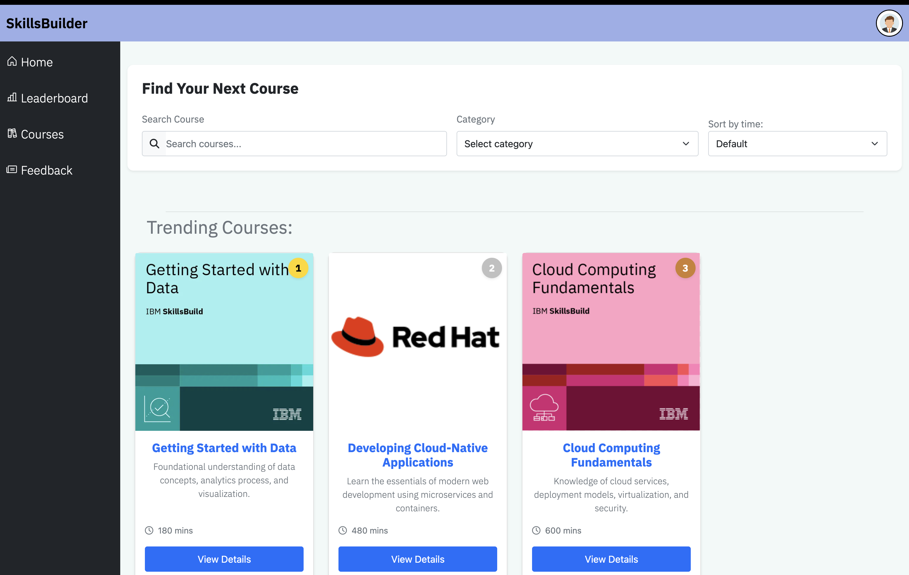

## Trending Courses 
The trending courses section allows you to view
the top 3 courses based on the number of users which have completed it

### Accessing the top courses
After you log onto the application, you would be directed to the user dashboard, this has many features but to access the list of courses you need to press the courses button.

### View the top 3 courses
Once you have entered the course page you can see the top 3 courses 

### How it works
It works by collecting a list of how many users have completed each course and then filters the courses based on the amount of users, it then displays the top 3 courses and ranks them in order of the most popular

as shown in the image above, the Course card will show the ranking 
### Summary of features
- Top courses are displayed at the top of the courses page
- The 3 top courses will be ranked in order and will display if it is 1st, 2nd or 3rd place
- Top courses will change over time depending on how many learners complete that course