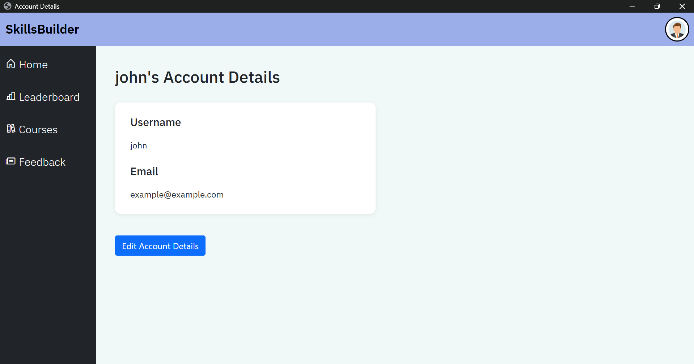
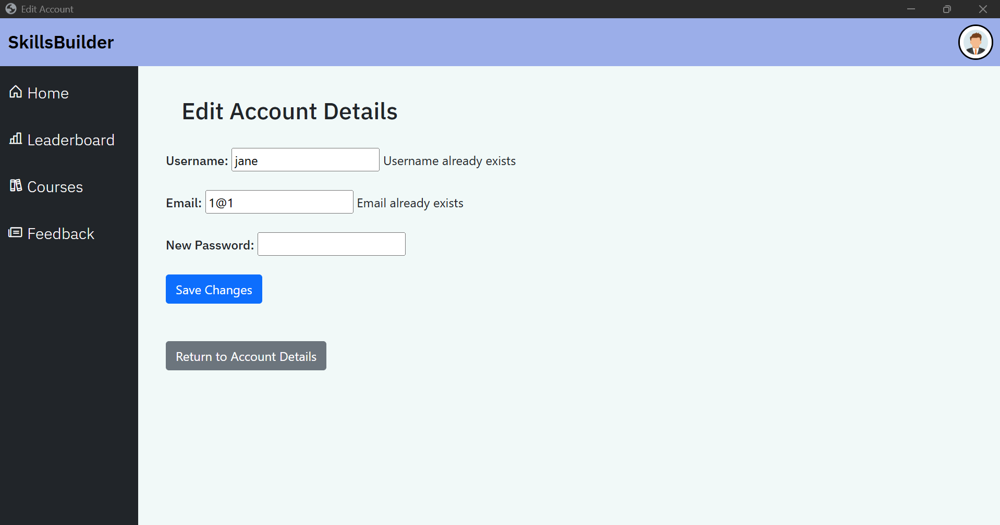

## Account details user story,

A user is able to view and edit their account details using this user story.
They're able to edit specific values such as: Username, Email and password.

# How to view Account details,

Firstly, login and you'll be redirected to the dashboard. Clicking on the avatar icon on the top right will allow you to use a top-down menu. Pressing account details will redirect you to URL /account where you can view your account details.

# How to edit Account details,

To edit your account details, simply press the edit details button below the information which will navigate you to a URL /editAccount.

Here, you'll be able to change your username email or password if you choose to. However it will need to be unique (Not already existing on the website) to ensure that all usernames and emails are unique. Once you meet the requirements and are happy with your changes simply select the save changes button. 

This will redirect you to the login page where you'll need to re-enter your credentials and to view your new changes just simply go to accounts again via the top-down menu.

# Errors with edit Account details,

# Username and Email errors shown by:

These two fields NEED to be unique values to ensure no duplicate values within the website to prevent errors. Once unique, it will allow you to save changes.

# Password errors shown by:

The password field has the same constraints as the login user story, making it so that the password will need to be 8 characters or longer. If not, you will be shown the error displayed via the image. Simply changing it to a 8 character or longer password will allow you to save changes.

