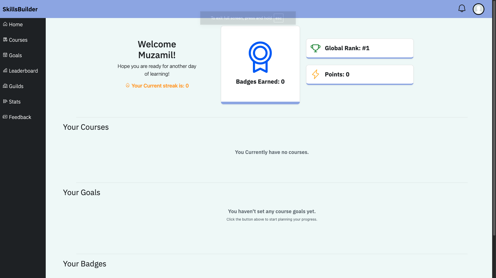
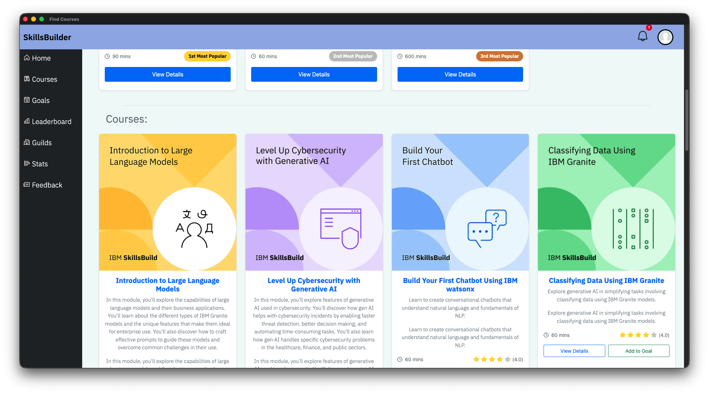
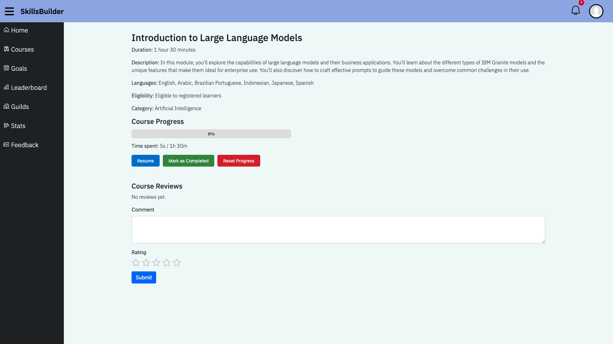
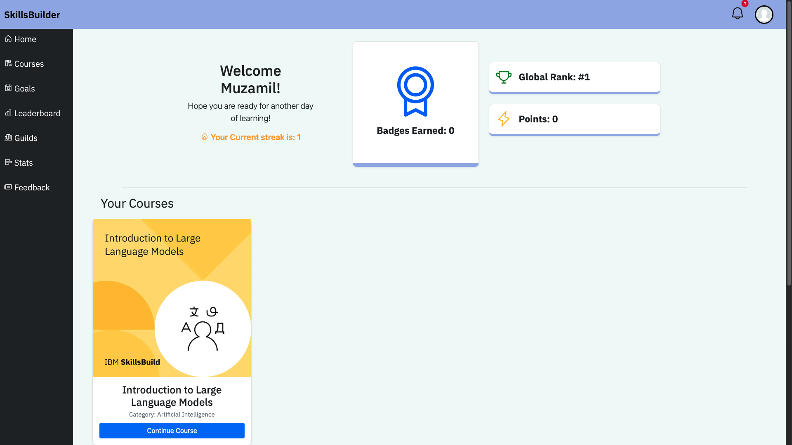
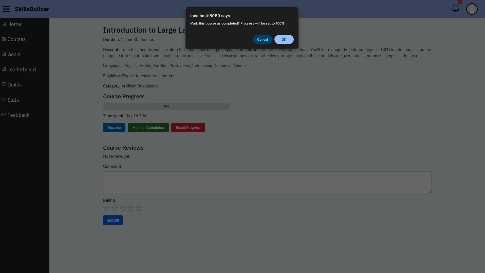
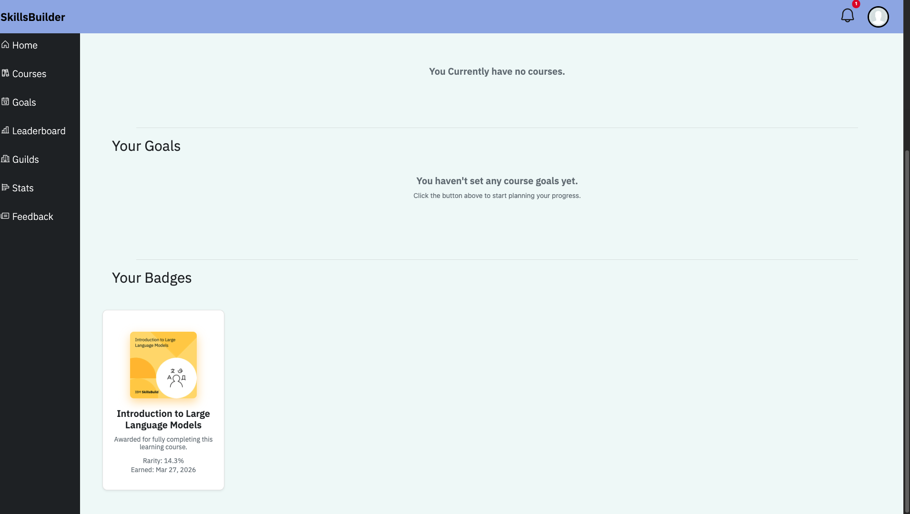
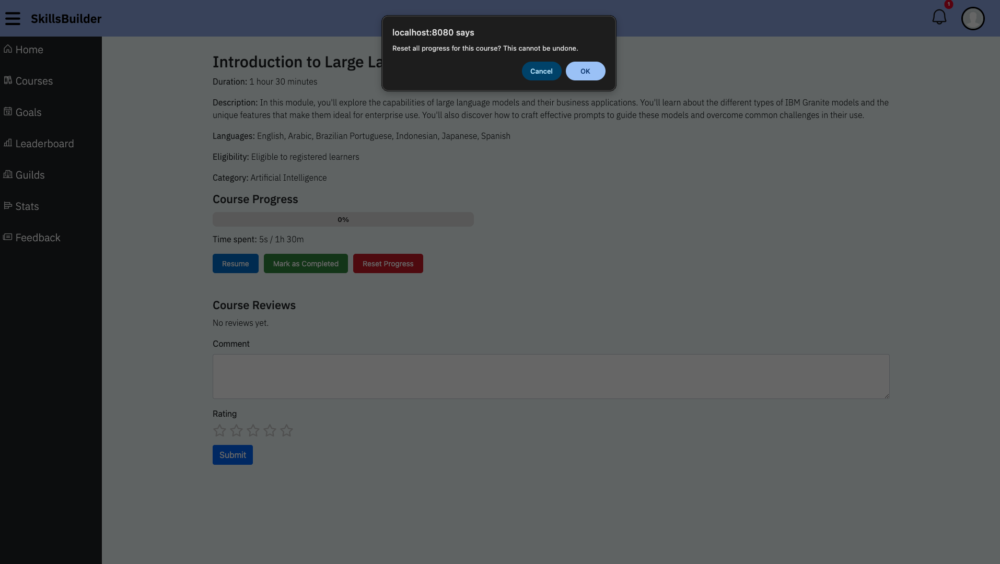

# Automate Courses
Automating courses allows you to start, reset and complete a course automatically, adding the course to the dashboard automatically, without the use of the add to dashboard button. In addition to this, it allows you to continue the course from the dashboard, and see a list of badges earned through courses completed.

## Starting a Course
In order to start a course now, the 'add to dashboard' button has been removed from the courses page, now meaning that to start a course and add the course to the dashboard, the user will have to click on 'view details' and start the course from that specific course page.

## Continuing a Course
Once the user has started a course, the course gets automatically added to the dashboard. If they would like to continue that course, the user can click on the 'continue course' button that the course icon now has on the dashboard.

## Completing a Course
Once the user has completed a course and has clicked on 'mark as complete' on the course page, the dashboard will now display the completed course on the badges section by giving the user a badge. This displays info such as the badges rarity and the date it was obtained.

## Resetting a Course
Once the user clicks on 'reset-course', the course will be removed from the 'Your Courses' section', Allowing the user to take the course again if they so please.

## Summary:
* Add courses to the dashboard when clicking 'start course'
* Continue courses from the dashboard by clicking 'continue course'
* Earn badges from completed courses by marking courses as complete
* Reset current/previous progress of courses by clicking 'reset course', removing it from 'Your Courses';.