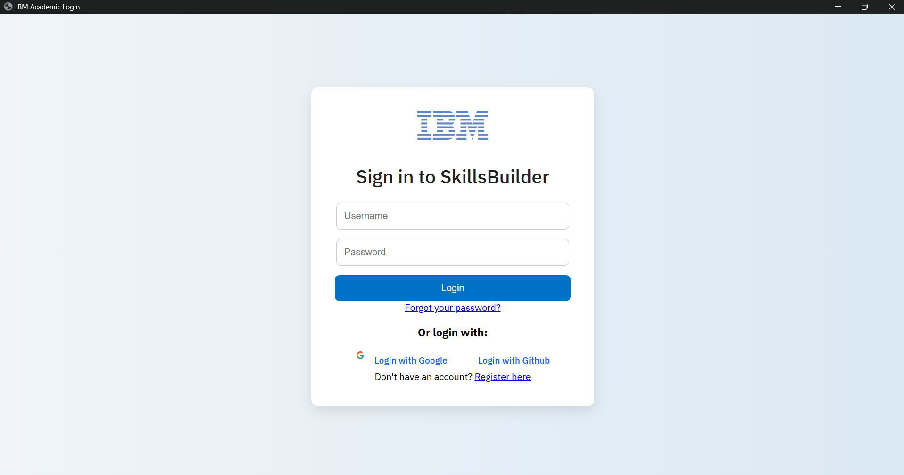
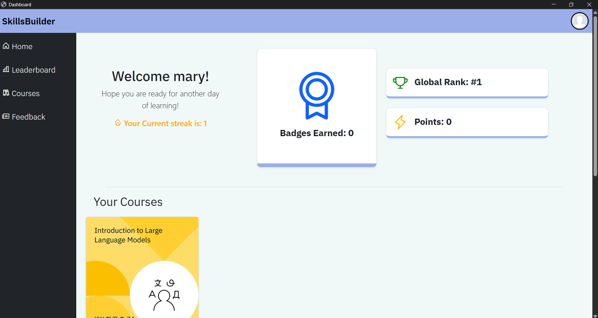
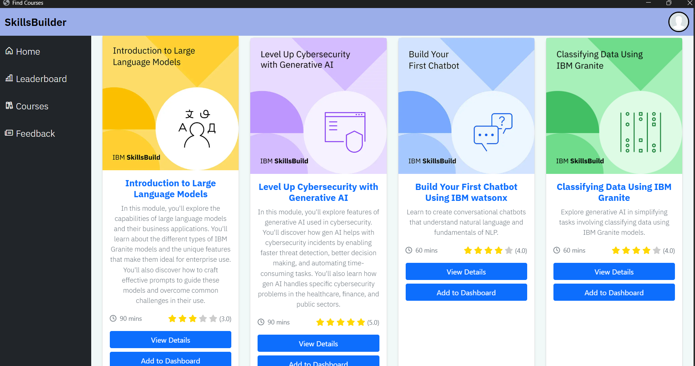
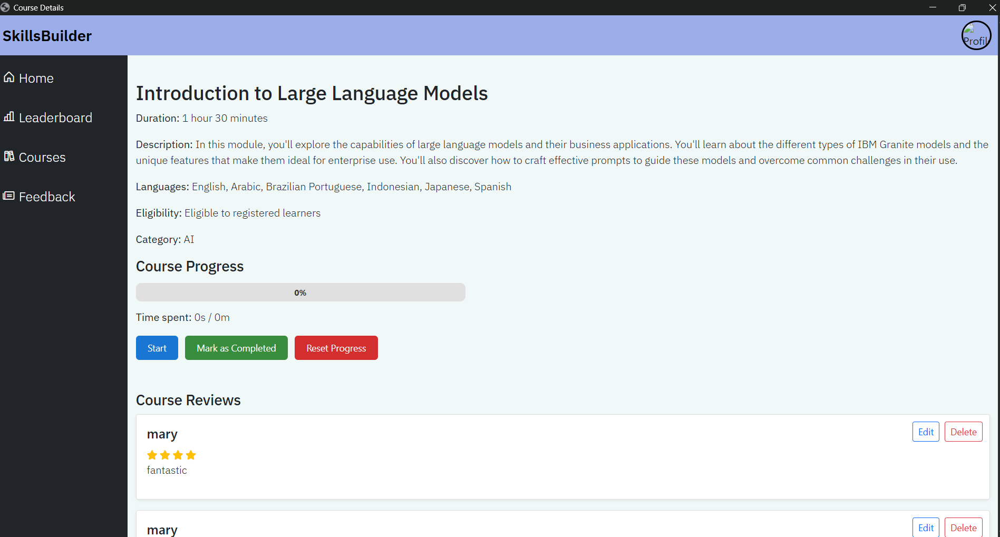
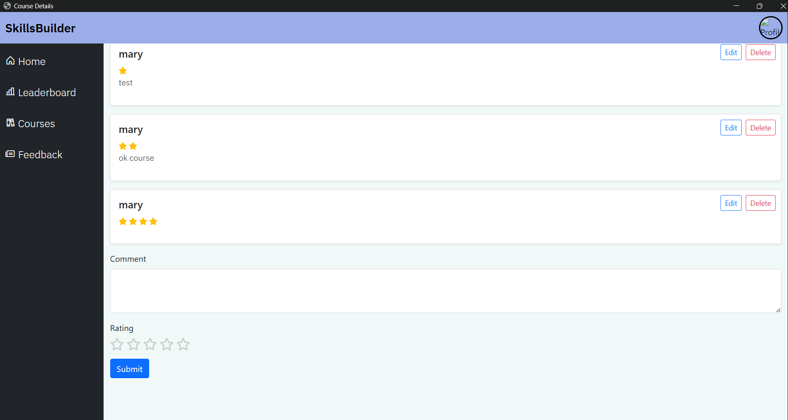
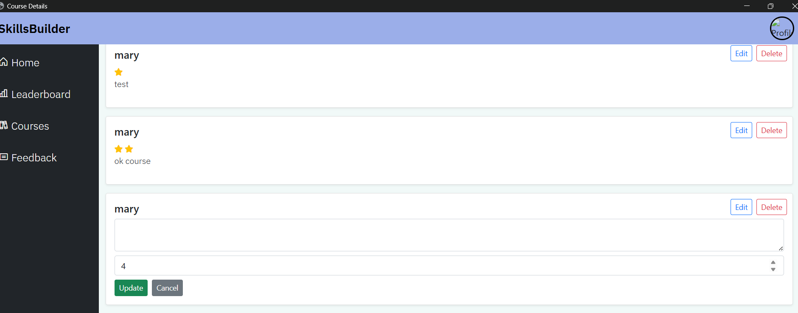
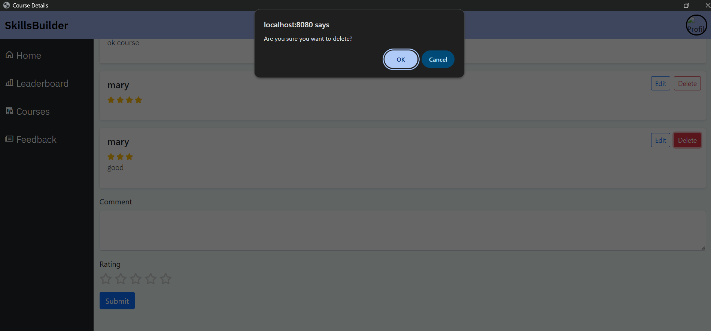

# User Manual: Comment amd Rating (Review)

## 1. Overview
The Comments and Ratings feature allows users to  express opinions, and evaluate courses to inspire others. 
This helps improve quality, and user experience.

---

## 2. Getting Started

---
### 2.1 Accessing the Feature
- Log in to your account 

-  On the dashboard, click on courses

- Navigate to the course you want to comment or rate.

- Click on details under the course

- Scroll to the **Comments** section under the course description.

- Ensure you are logged into your account.

---

## 3. Submitting a Rating

### 3.1 How to Rate
1. Locate the rating section (usually displayed as stars).
2. Click or tap your desired rating (e.g., 1–5 stars).
3. Your rating will be recorded instantly or after submission.

### Rating Scale
- ⭐☆☆☆☆ – Poor
- ⭐⭐☆☆☆ – Fair
- ⭐⭐⭐☆☆ – Good
- ⭐⭐⭐⭐☆ – Very Good
- ⭐⭐⭐⭐⭐ – Excellent

---

## 4. Writing a Comment

### 4.1 How to Comment
1. Click on the **"Write a Comment"** or similar button.
2. Enter your feedback in the text box.
3. *(Optional)* Add a title or summary.
4. Click **Submit**.

### 4.2 Comment Guidelines
- Be clear and specific.
- Stay respectful—no offensive or abusive language.
- Avoid spam or irrelevant content.
- Do not share personal or sensitive information.

---

## 5. Editing or Deleting Your Review

### 5.1 Editing a Comment
- Locate your comment.
- Click **Edit**.
- Make changes and save.
- 

### 5.2 Deleting a Comment
- Click **Delete** next to your comment.
- Confirm deletion when prompted.

---
---

## 6. Best Practices for Users
- Provide balanced review (pros and cons).
- Base your rating on genuine experience.
- Update your review if your opinion changes over time.

---

## 7. Troubleshooting

### Common Issues
- **Cannot submit rating/comment**: Ensure you are logged in.
- **Comment not appearing**: It may be under moderation.

---

## 8. Contact & Support
If you encounter issues:
- Contact support via email on [email] (admin@ibmskillsbuild.com)
- Provide details such as screenshots or error messages