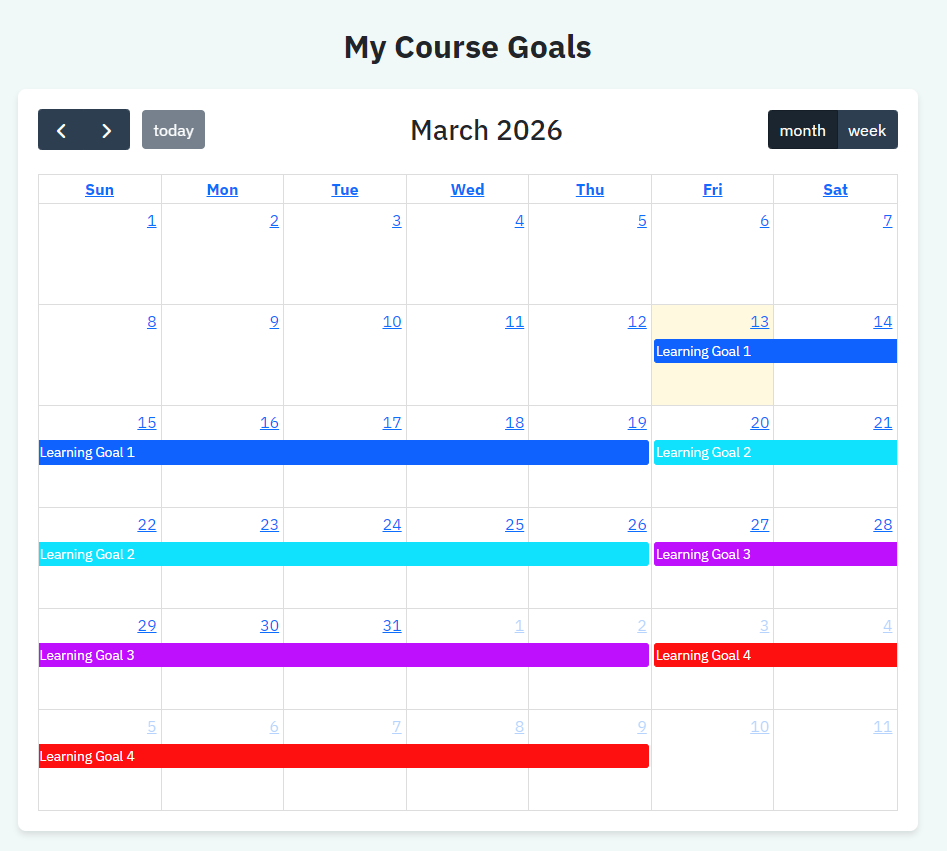
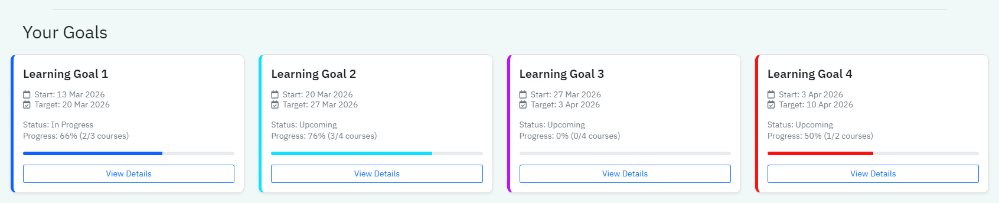
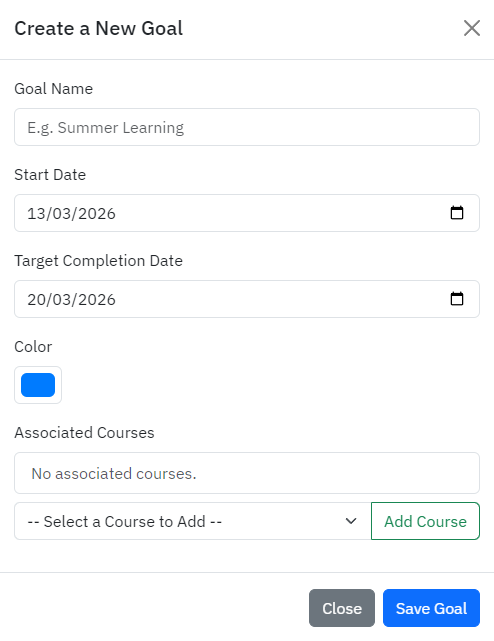
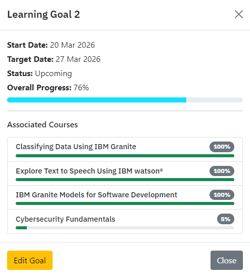
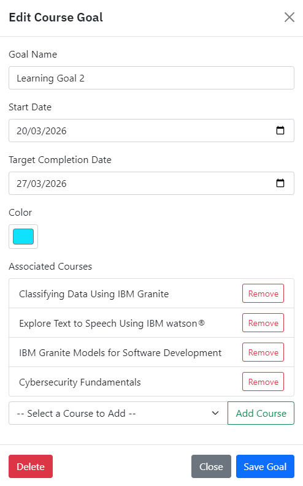

# Course Goals - User Documentation

## Table of Contents

1. [Overview](#overview)
2. [Viewing Goals on the Dashboard](#viewing-goals-on-the-dashboard)
3. [Adding a New Goal](#adding-a-new-goal)
4. [Viewing Goal Details](#viewing-goal-details)
5. [Editing or Deleting Goals](#editing-or-deleting-goals)
6. [Goal Completion & Rewards](#goal-completion--rewards)

---

## Overview

The **Course Goals** feature allows you to set specific target dates to complete a selection of courses, track your overall progress, and visualise your deadlines on a calendar.

Key capabilities:
- **Track Percentage Progress:** Monitor your individual course progress and overall goal completion percentage.
- **Visualise Deadlines:** See your goal milestones and deadlines seamlessly via the interactive **Goals** calendar.
- **Dynamic Adjustments:** Edit deadlines, adjust your selected courses, or delete your goals entirely as your schedule changes.
- **Goal Completion Rewards:** Earn 15 bonus points for each new unique course you complete as part of a goal!

---

## Viewing Goals on the Dashboard

Once you have logged in, your active course goals are displayed directly on your **Dashboard** in the "Active Goals" section. 

Each goal card outlines the number of courses required, the start and target dates, and your current completion status (goals set to start in the future will display as **"Upcoming"**). The card also features a progress bar and percentage text (e.g. `Progress: 75% (3/4 courses)`) to visually represent the average completion percentage across all courses in the goal.

---

## Adding a New Goal

You can create a new goal by navigating to the **Goals** (Calendar) page and either clicking the **"Add Goal"** button or simply **clicking a specific date directly on the calendar**. Clicking a date will automatically pre-fill your Target Completion Date to exactly one week out.

You can also create a new goal quickly from the Course Search page using the "**Create Goal**" modal!

This will open a form where you can:
- Define the Goal Name (empty names are not allowed).
- Select one or more courses to attach to the goal.

---

## Viewing Goal Details

To get more information about a specific goal, including a breakdown of individual course progress within that goal, you can click the **"View Details"** button on the dashboard goal cards. 

Alternatively, you can click on the colored goal event directly on your **Calendar**. This opens a comprehensive pop-up showing step-by-step progress and specific start/end dates.

---

## Editing or Deleting Goals

If you need to adjust your deadline, add/remove courses, or change the designated calendar color, you can easily edit your goal. 

From the View Details pop-up (accessible from both the Dashboard and the Calendar), click the **"Edit"** button. Make your required adjustments and click **Save Goal**. If you wish to remove the goal entirely, you can click **"Delete"** from within this same edit menu.

---

## Goal Completion & Rewards

As you progress through the courses assigned to a goal, your completion status natively synchronises across the overall goal duration. Every course's progress counts uniformly towards the total average goal completion metric (i.e. four courses, each completed 100%, represents 1/4th of the total).

The goal will automatically update its status to **"Completed On Time"** or **"Completed Late"** once all assigned courses definitively meet their completion requirements. Successfully completing a goal awards your account with **15 bonus points** for every *new standalone course* completed. 

*(Note: The system contains strict anti-abuse protections. If you add a previously completed course to a new goal to inflate the numbers, or continuously recreate duplicate dummy goals, you will effectively earn 0 points, as you only receive bonus goal points for the first-time clearing of a unique course!)*
