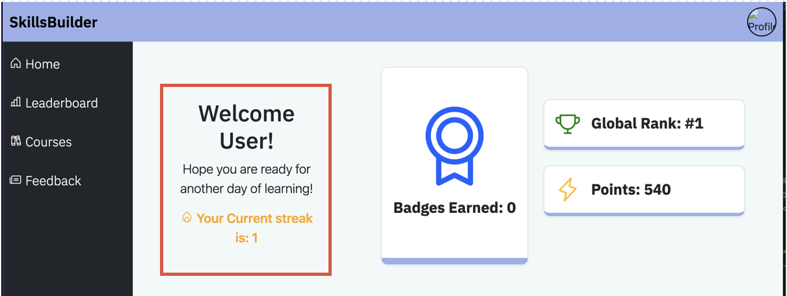
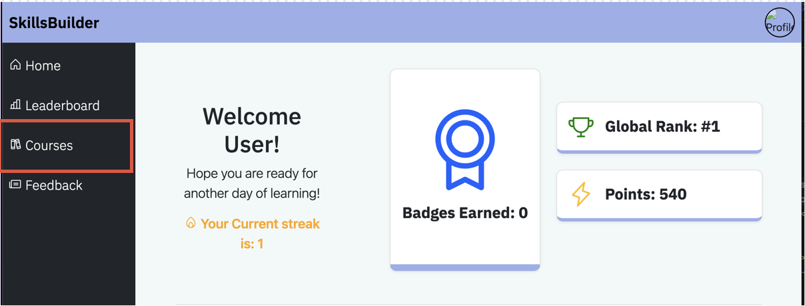
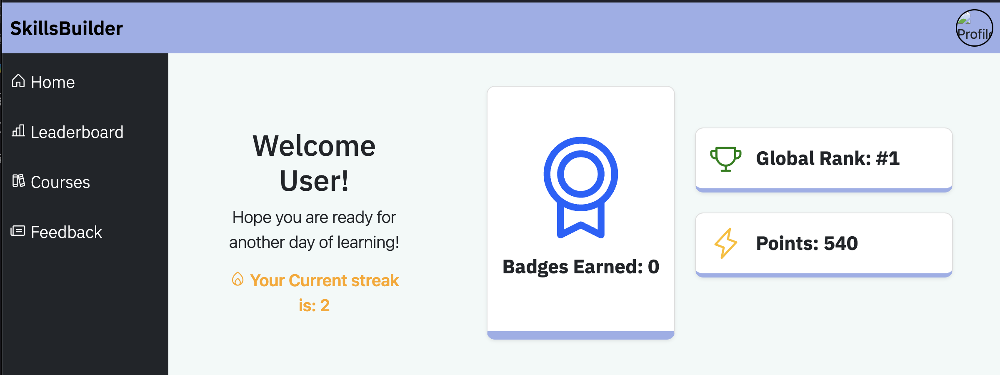
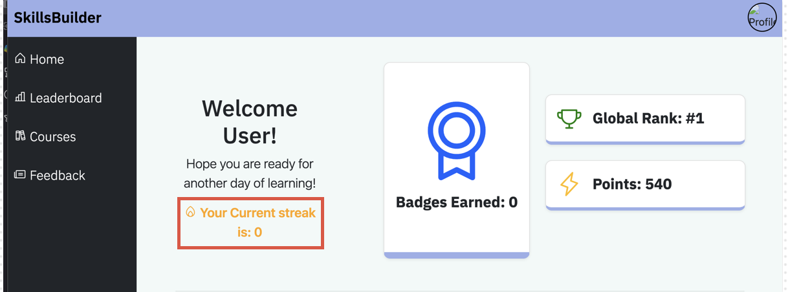

## Streaks

### Accessing the streaks section
To access the streaks section, you log into your account, once you have logged in you will be redirected onto your dashboard. On the dashboard there should be a section that shows the streaks for the user that is logged in. if you are unable to see it due to the size of the display in which you are using it, try to scroll down to see it.

### Increasing the streaks
To increase the number of days in which you have on your streak, you need to show some form of interaction with the courses. To show it on this application, you press the courses button. If it is the first time in the day you are doing so, the number which you have on the streak will increase by 1 and subsequent presses of the button will not change anything regarding the streak.

Once you have pressed the course page, the streak will update by one day

### Losing your streak.
If you have not used the website in over a day, your streak will be lost, and it will go to 0 days.

### Summary of streaks
- A user can increase their streak through login into their account and going onto the courses page
- Users can see their streak on their dashboard
- A user can lose their streak by being inactive on their account for over 1 day.