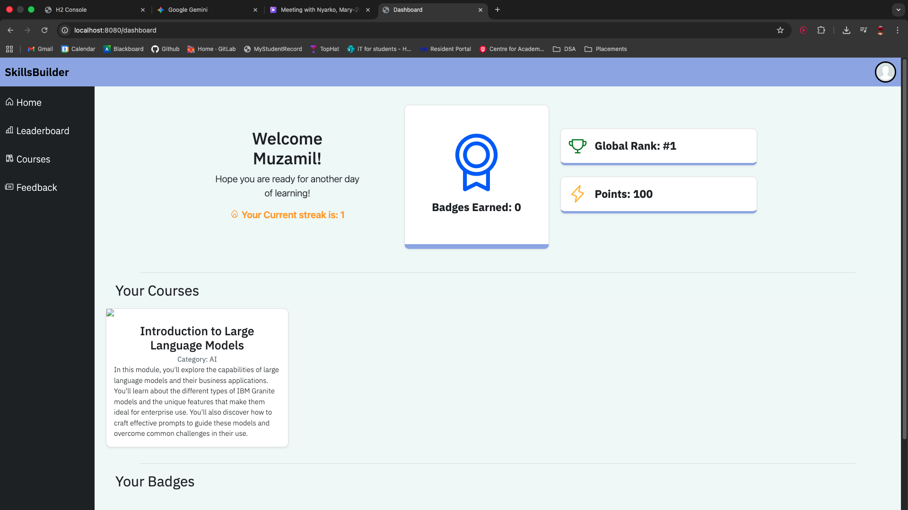
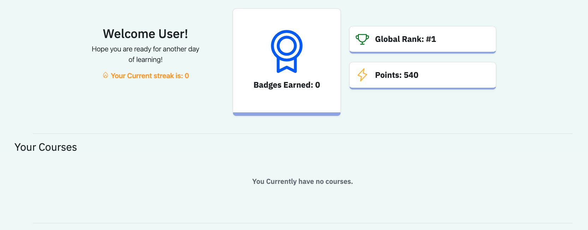
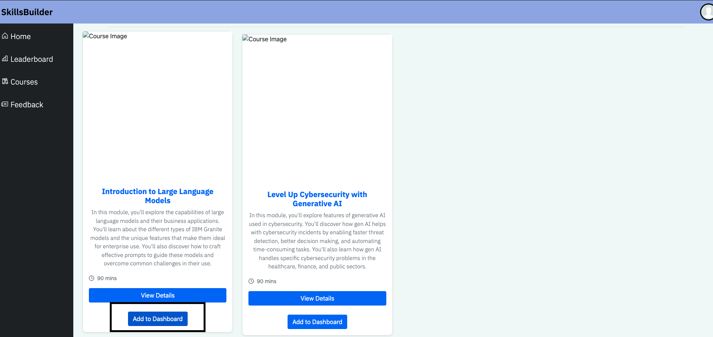
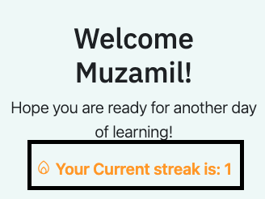
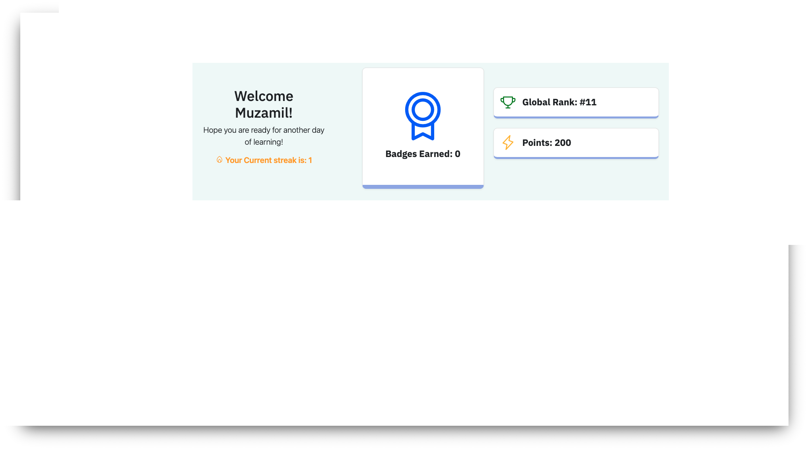
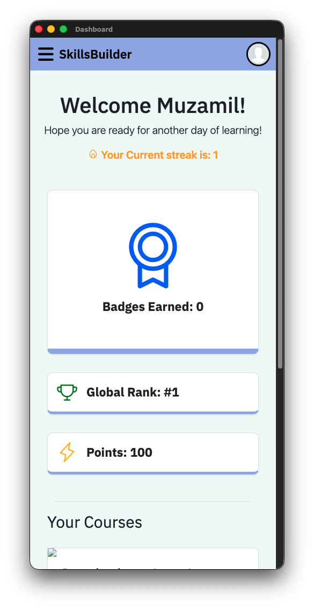

# View Dashboard
The dashboard page allows you to view all of the courses you are currently taking, to shows the number of badges you have earned, your leaderboard ranking, number of points earned and the current daily streak of the user at a quick and efficient glance.

## Starting the Dashboard
Once you sign in, the dashboard will display a welcome message with the username on it. The user profile picture will also be automatically generated and displayed on the right-hand side, and the top of the dashboard will also display the daily streak, number of badges earned, leaderboard ranking and the number of points the user currently has. Streaks, badges, points and the leaderboard will automatically be applied and shown when the user has accessed those sections and pages of the site.

## Adding and Displaying Courses
In order to display the courses the user is currently taking, once logged in, a messege will be displayed saying if the user has not added any courses yet. To add courses to the course list, the user can add the courses from the courses page. This will display the course along with its category, description and image on the dashboard.

## Displaying the streaks
The user streaks will also be showcased on the dashboard. This increases once the streak increases each day.

## Points and Global rank
The dashboard will display the user rank and points earned from the leaderboard, once the user has gone on the dashboard page their rank will automatically be applied to the page once accessed again. Points will also be shown once the user has started to earn points from the leaderboard.

## Mobile view
The dashboard has been designed to include a mobile view once accessed. Elements will be stacked in a mobile view and the side nav disappears to reveal a vertical navbar.

## Summary:
* View user information, leaderboard ranking and points earned
* Display a list of courses to be added to the page.
* Display the daily streak
* Showcase a mobile dashboard