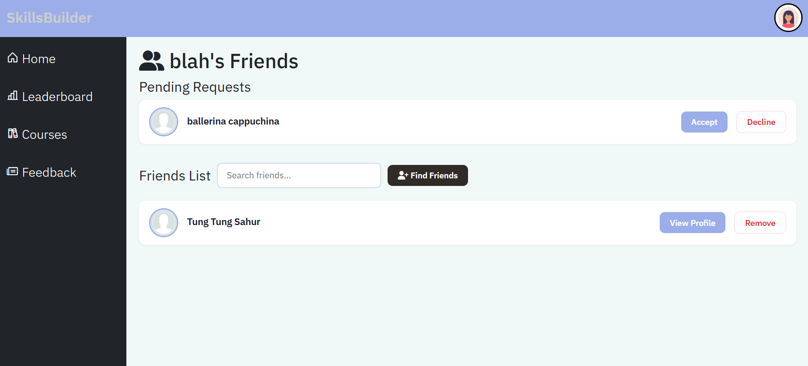
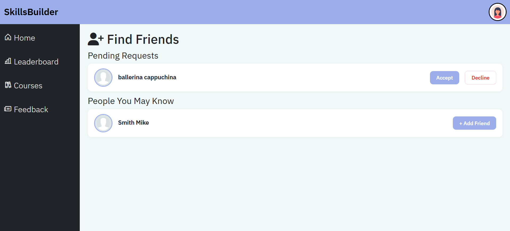
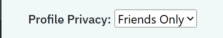
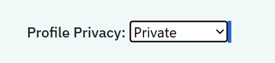
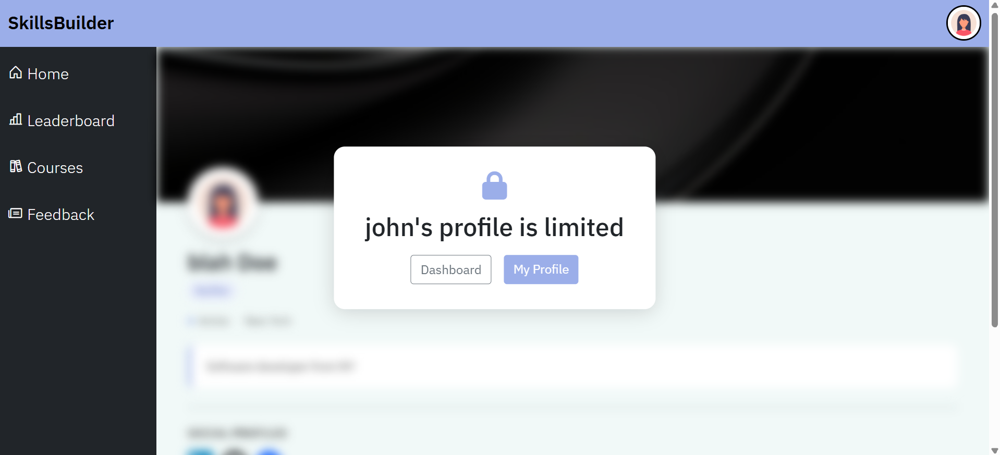

## Friends system,

In the friends system, users can find other users in which they are free to add them. Additionally,
with this feature there is an updated profile privacy feature to filter profile views based on this.

## Navigating to friends,

To navigate to friends, simply go to the top-down avatar menu and select it, pressing
the button 'Friends' will redirect you to your own friends page where you can see:
- Your friends, including their user profile attributes
- A button to view profile and to remove them as a friend

If the url id is equal to your user's id, you will have access to a button which you can remove friends, doing so will remove them from your friends page where they are available to re-add on findFriends.

## Finding friends,

Additionally, there is another button to find friends, selecting it will redirect you to findFriends which will list all available users on the skillsbuild. You are able to search for specific friends using the search bar.

## Friend requests,

Sending a request from findFriends or by another user will be available to you to see on both friends and findFriends URL, showing their user profile attributes with two buttons to accept or remove them. This is unavailable to select if the current user is not yourself, meaning no one can tamper with this.

Rejecting the request will:
- Remove them from your requests tab
- Move the user back to findFriends URL

## Profile privacy

Another feature is profile privacy, where you have three toggable modes which can limit who views your profile such as: Public, Friends only and Private.

Selecting this will only allow people who have yourself as their friend able to visit your profile page, limiting access to people who aren'tab

Selecting private will restrict all users as well as people who you have as friends, meaning no one is able to access your profile except yourself.

## Limited page

If you select these changes to your profile privacy and the user does not meet the requirements to view your profile they will be met with,

This limited page is an extension of profile privacy which blurs the users contents (profile), meaning its unable to read or access. This limited box will give a message regarding the profile privacy giving you two links: Going back to dashboard and to go back to your own profile.
