## Guild system

The guild system consists of forming guilds (teams) of 8 users in which they can gather points and compete in the guild leaderboard.

## Finding a guild

To find a guild, after login and redirected to dashboard, press the guild in the side nav.

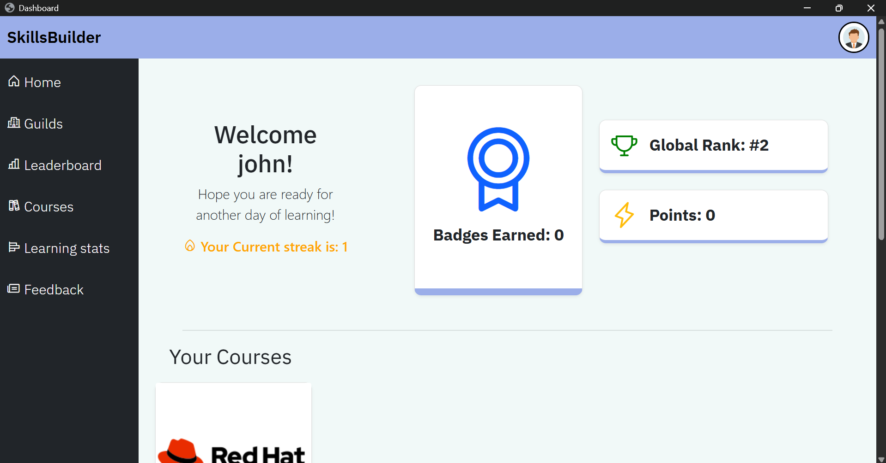

After pressing guilds, you will be redirected to /guilds,

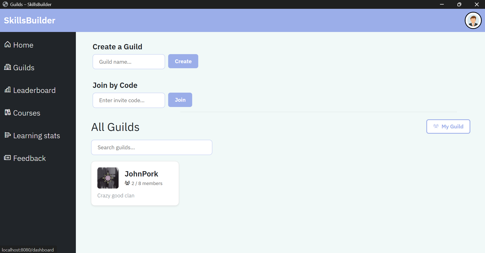

## Creating guild

To create a guild, go to the create guild input box and enter a name. If successful you will be redirected your guild page where you will be given the role of guild MASTER.

### Error handling with creating guilds,

#### Error one, special characters
If you enter special characters you will receive an error on the form and will not be able to create the guild. This contains any special characters.

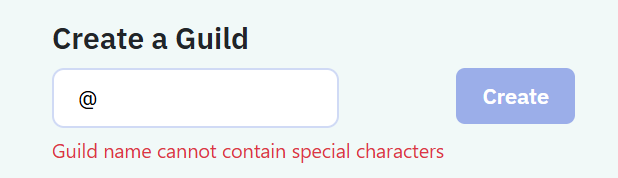

### Error two, Already being in a guild
If you are already in a guild you wont be able to create a new guild.

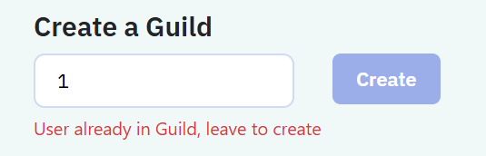

### Error three, guild name exists
If the guild name you enter already exists, it will not create the guild.

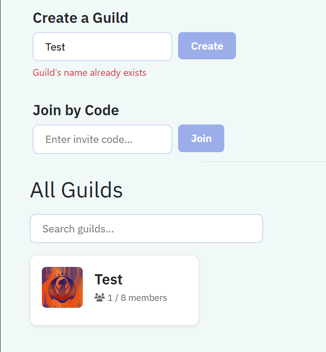

## Joining a guild
To join a guild, simply enter the guild code given to you into the join code form, if successful you will be redirected to the guild page and be a member inside the guild home.

### Error one, invalid code
If the code is invalid you cannot join the guild and will receive this prompt.

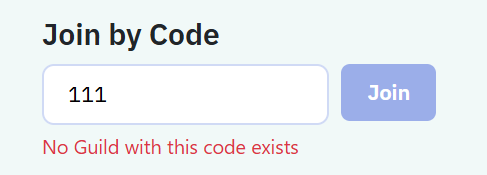

## Guild home page
Once you have created a guild or joined one, you will be able to view the guild home page. You can access the guild home by pressing "My guild" or clicking the guild which is yours in "All guilds".

If you are a ROOKIE / CAPTAIN you will have this page,

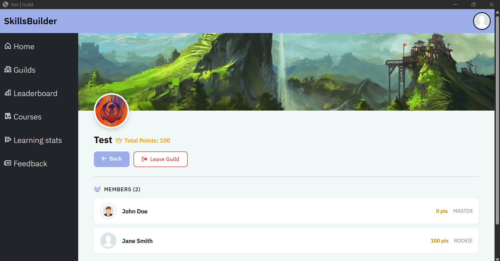

If you are the MASTER, you will have an extra button to edit the guild,

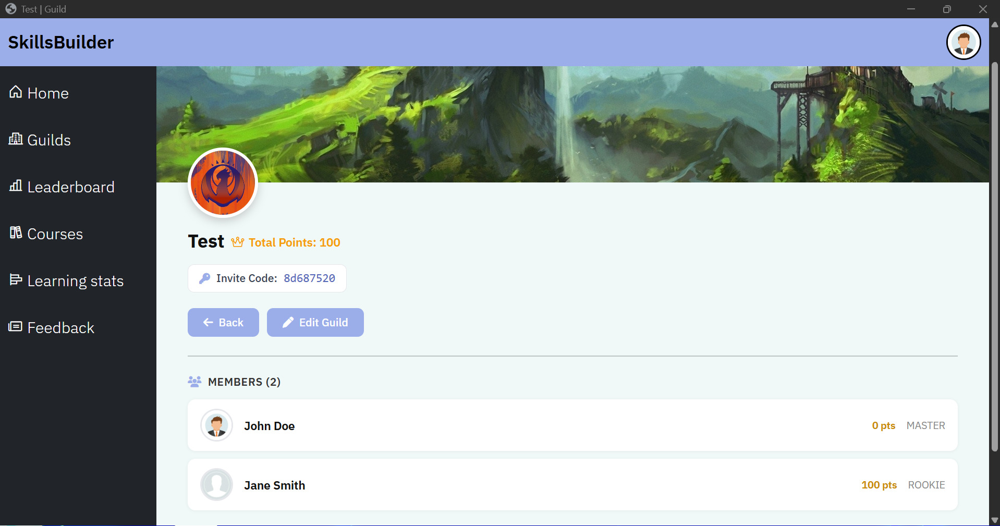

A completed guild page will look like,

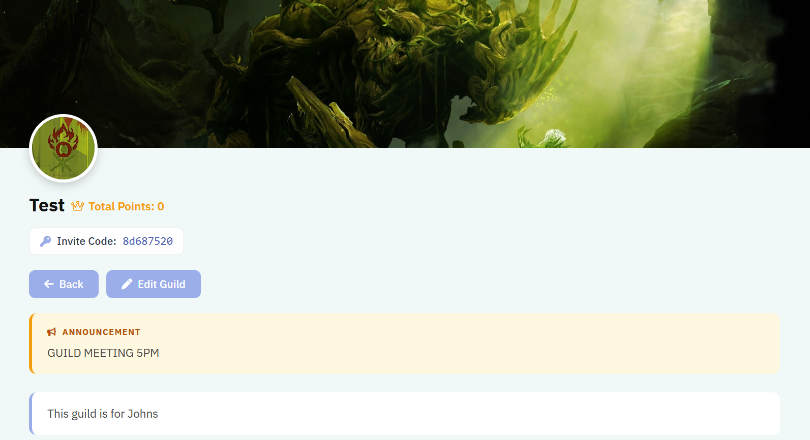

If you are a ROOKIE, the invite code will not be visible unless
you are a CAPTAIN or MASTER.

## Edit Guild

Go edit guild, you must be the MASTER, to edit press the edit guild button.

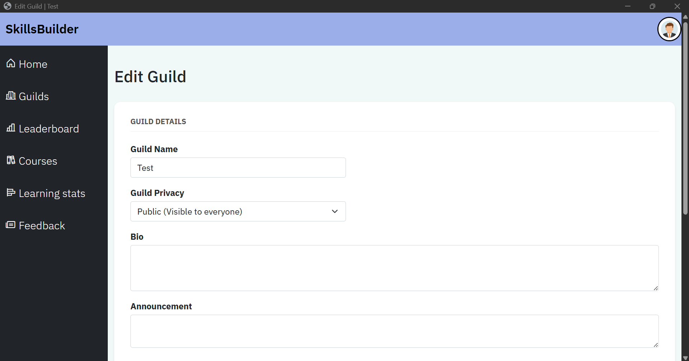

You are able to change the guild name, privacy, bio and announcements.

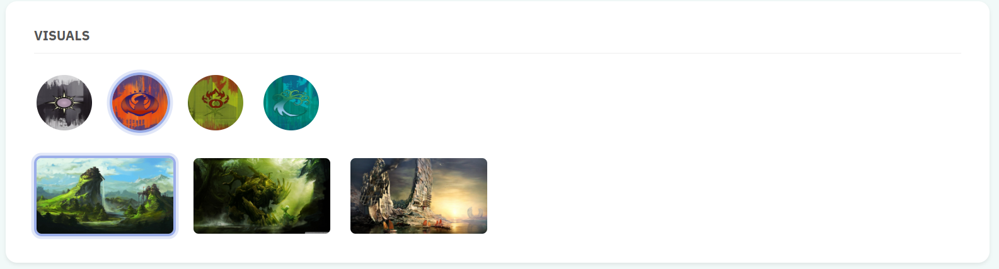

Here you are able to change the avatar and background

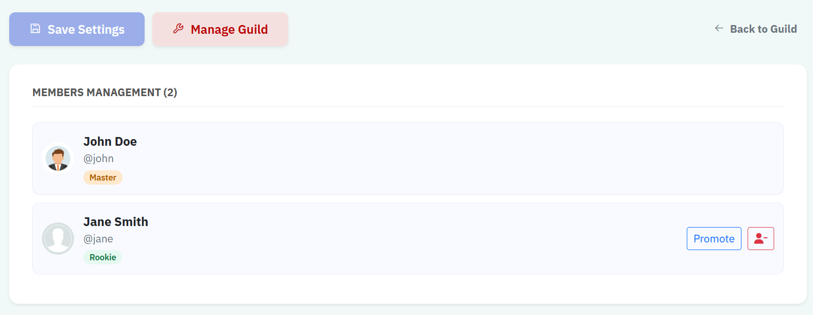

Here you can press save settings for the first segment.
There is also a manage guild button to delete or promote users; Additionally, there is a 
button to go back to your guild home.

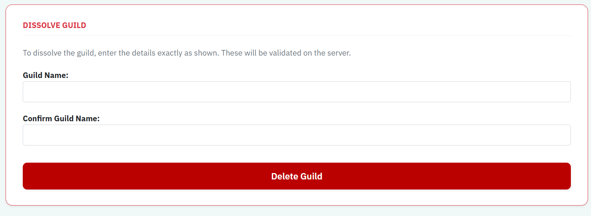

The delete form contains the reject Value created in the controller to ensure that the user will have to type the guilds name twice and also matches the guilds name.
If deleted you will be redirected to /guilds and all users will be removed from the guild.

To kick a user simply go to manage members and press the red button next to the promote button to remove them, if you want to promote them simply press promote.
To promote someone to master, simply press the promote button on a captain, this makes the user a master and yourself a captain.

## Guild privacy

If selected guild privacy, a user who is not in your guild will be met with the following:

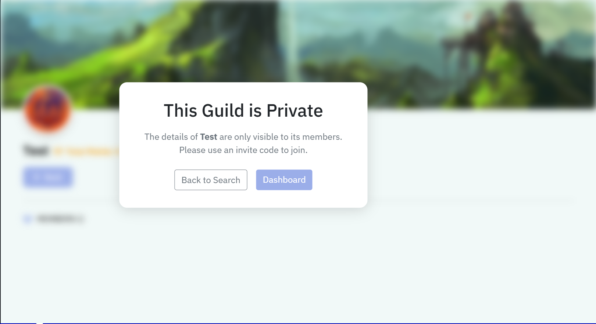

The user will have to go to the dashboard or /guilds (search)

