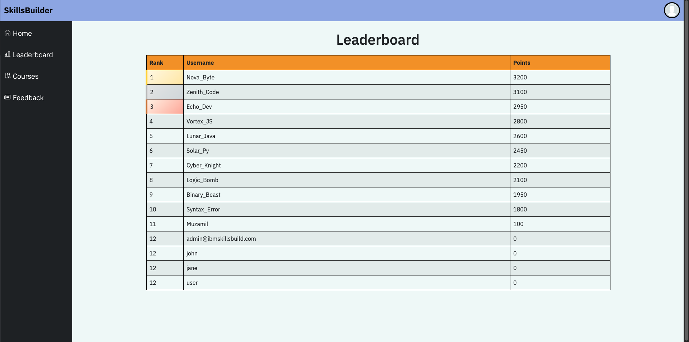
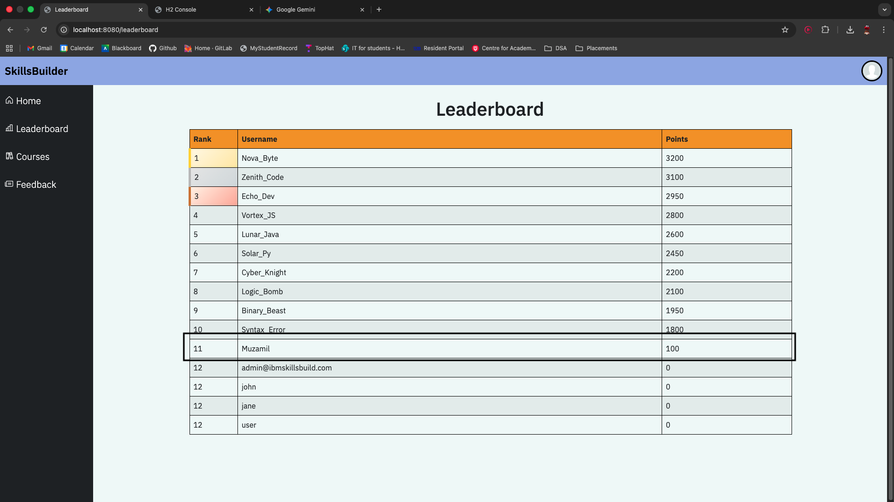
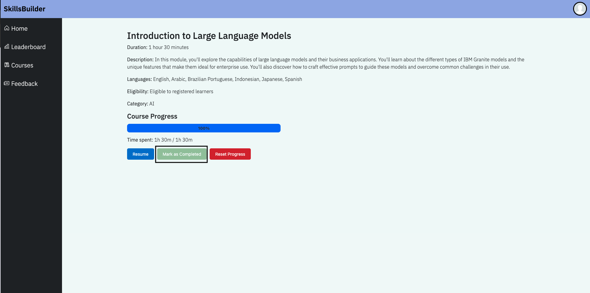
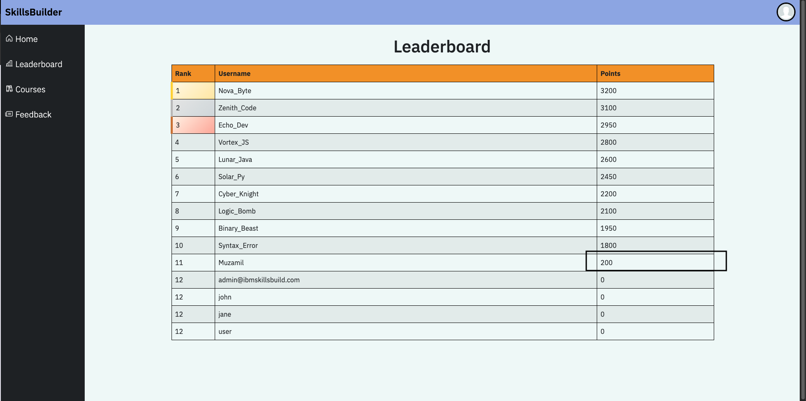
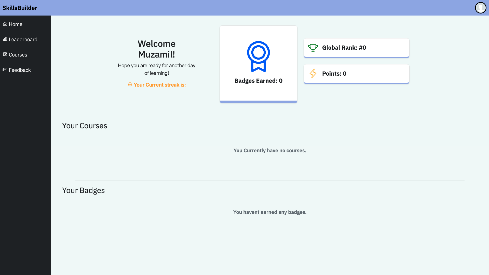
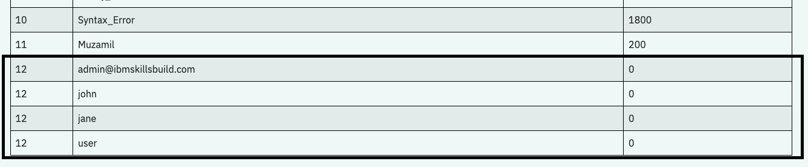
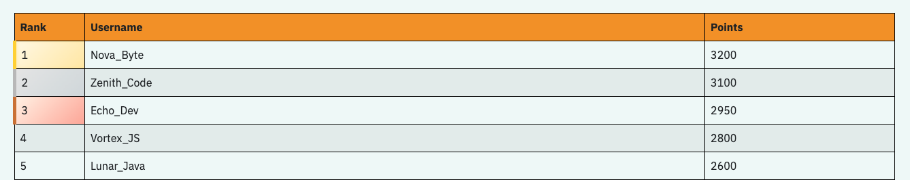

# View Leaderboard
The leaderboard page allows you to see the ranking of you or others based on the number of points the user has earned. The leaderboard automatically calculates and assigns the rank based on the number of points a user has on the leaderboard, relative to other people on the current leaderboard ranking. Each row displays the rank, username and number of points that user has earned.

## Starting the Leaderboard
Once a user has registered their account, logged in and went onto the leaderboard page, the leaderboard adds the name, points and ranking of the user and displays it in accordance with other users on the leaderboard. Once a user has started to earn points, their ranking increases automatically.

## Earning Points
A user is able to earn points and increase their ranking by completing courses. This awards a user with 100 points each. In addition to this, streaks also award users with points once they have hit 7,14 or 30 days.

## Viewing rankings on the dashboard
Once the user has accessed the leaderboard page, their ranking and points will be shown on the dashboard. This updates with real time.

## Duplicate Rankings
To accomodate for users with the same number of points, both users will recieve the exact same rank on the dashboard.

## Special Styling
Users apart  the top 3 will recieve respective gold, silver and bronze styling to showcase their achivement.

## Summary:
* View your ranking against other players.
* Earn points by completing courses and logging in to increase the streak.
* showcase your points in accordance to other players.
* Showcase your current rank and points on the leaderboard.
* Share the same rank for the same number of points with another player.
* Showcase special styling as apart of the top 3.