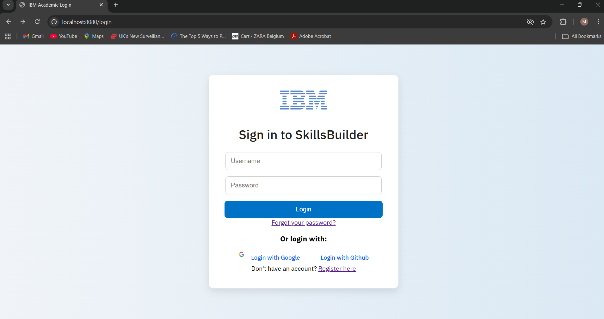
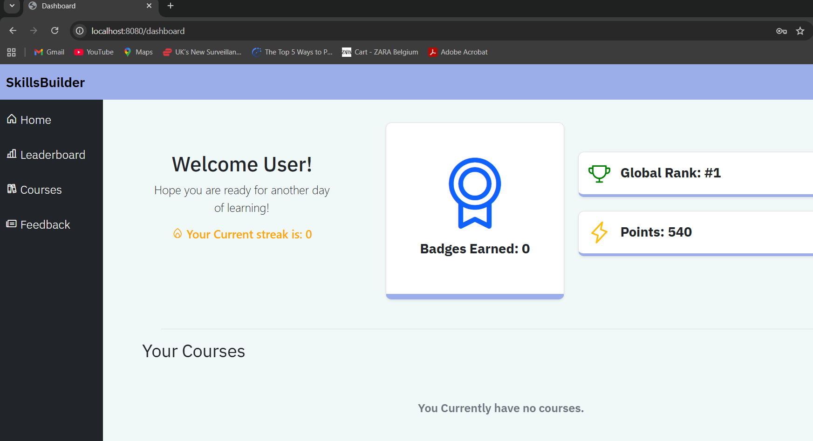
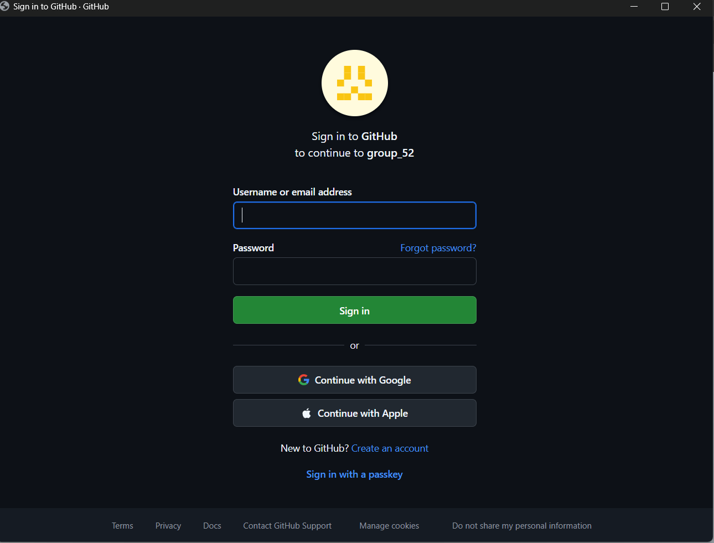
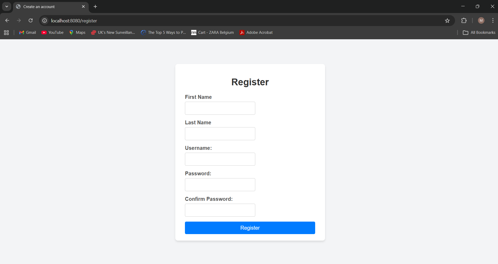
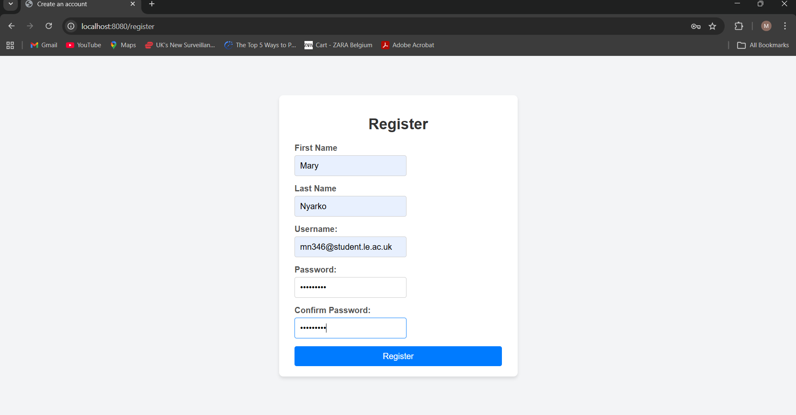
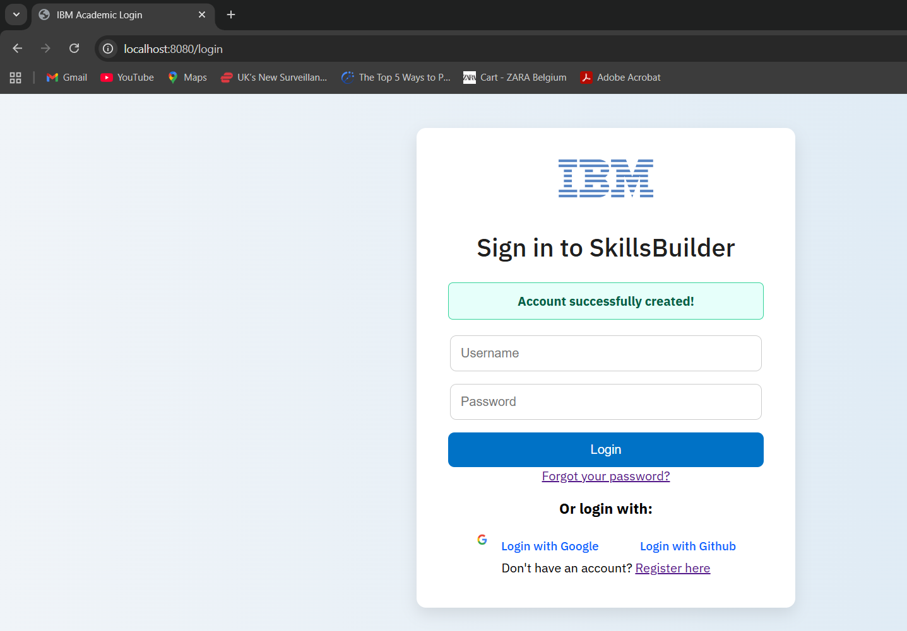

## Login and Register Feature

---
### Accessing login page

#### Login
- To access the skillsbuilder website, a registered user can log in using their 
account details, which is the username and password

- Spring security will authenticate credentials and if it fails, error message shows and user is redirected to the login page
- If authentication succeeds, user is redirected to dashboard.jsp

---

#### OAuth2 Login (GitHub & Google)
- User can also login with github or google by clicking on **Login with Github** or **Login with Google**
- User is redirected to the OAuth provider where the application is authorised by user

- The provider returns user details to the application
- If the user does not exists in the database, a new user record is created in MySQL

---

### Registration
- A new user who wants to create an account clicks on **Register**

- New user is redirected to register page where they are required to enter 
  - First name
  - Last name
  - Username
  - Password
  - Confirm Password

- User then gets to submit forms, is redirected to login and sees message "Account successfully created"

### Security & Validation Checks

- Passwords are hashed and stored in the database
- Password length check is in place
- CSRF protection is enabled for forms
- Auth2 tokens are handled securely by Spring Security
- Email/username must be unique
- Required fields must not be empty
- An existing user can create a new password if they forget their user password

### Error Handling
- Empty required fields gets the error message "This field is required"
- Password mismatch gets the error message "Passwords do not match."
- Already existing user gets the error message "User already exists"
- Invalid login credentials gives the error message "Invalid username or password."

### Summary of Login
- A new user can create an account with their credentials
- An existing user can login with their username and password
- A user can login with OAuth2 Login
- A forgotten password can be retrieved
