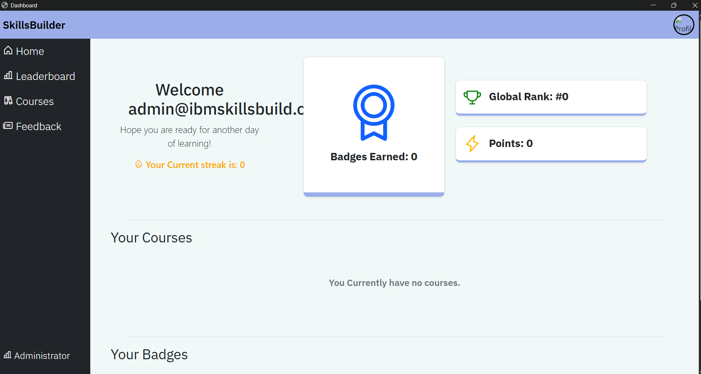
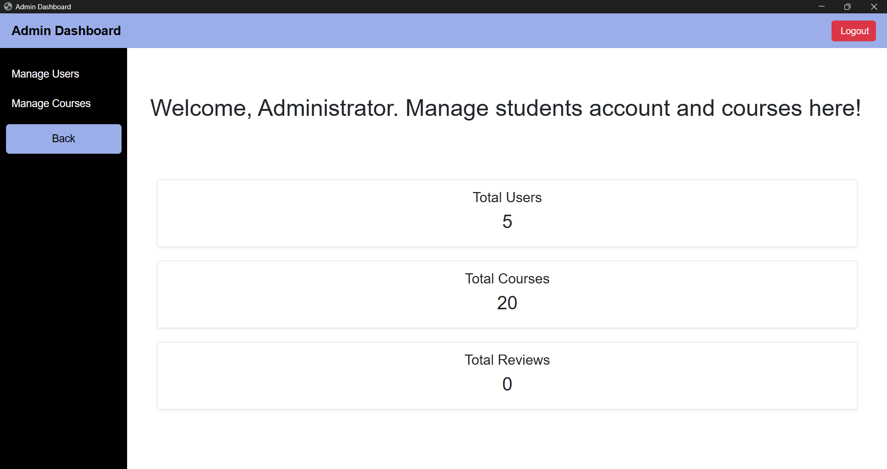
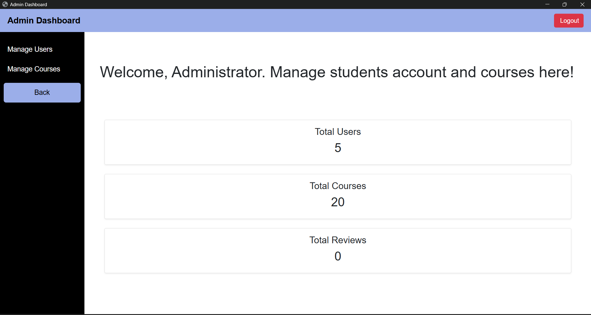
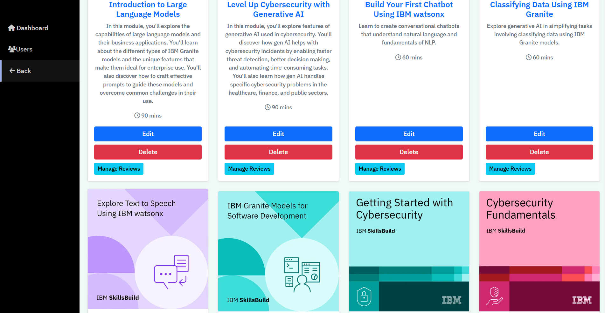
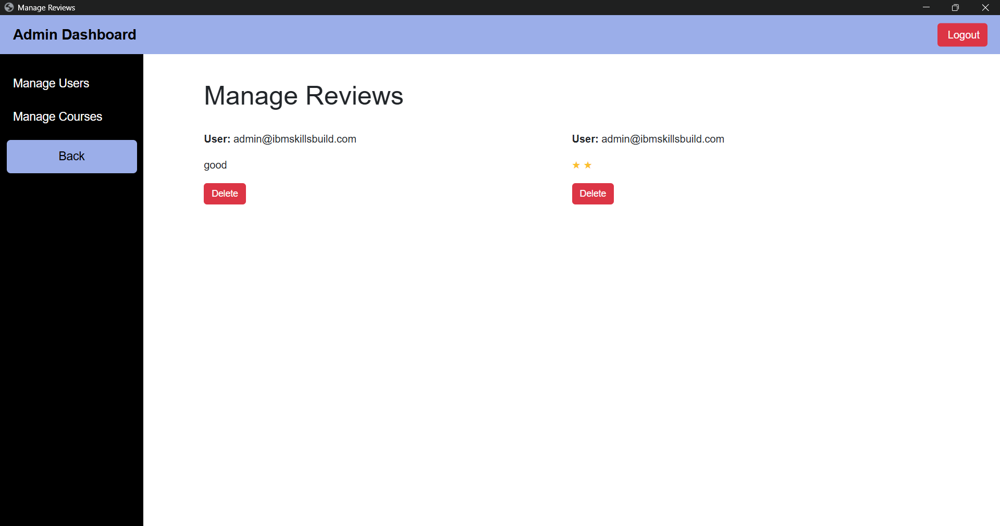
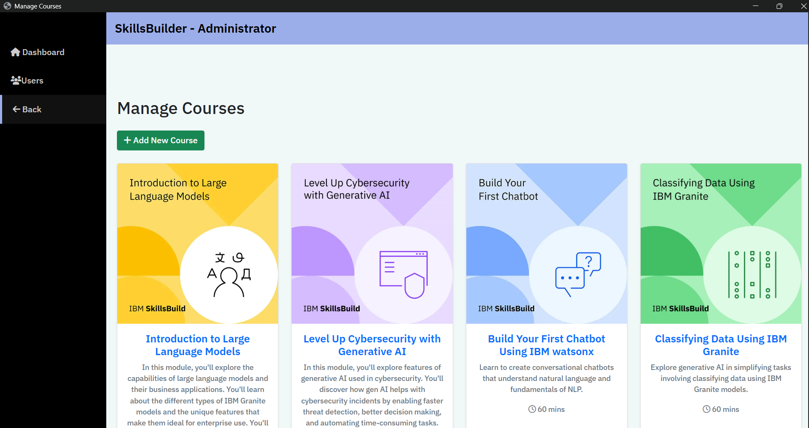
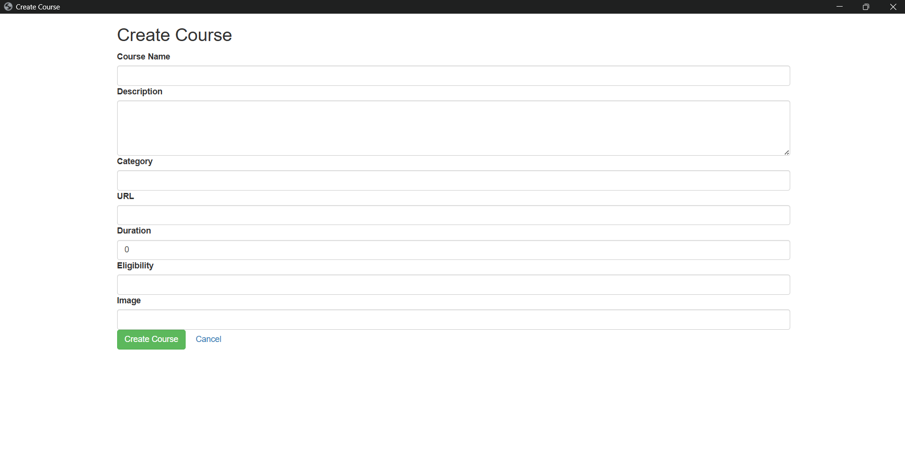
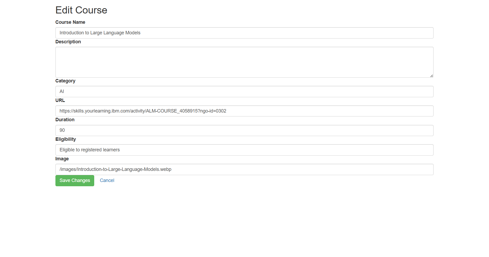
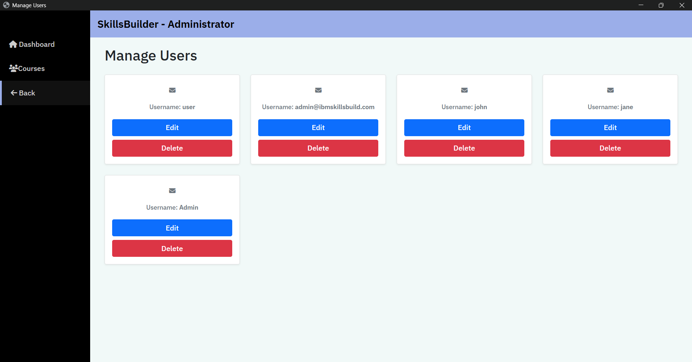
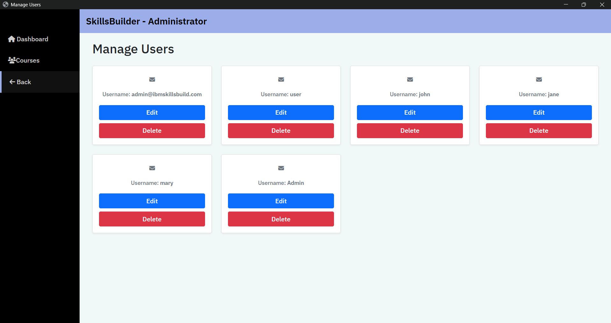

# Admin Manual: Manage Review

## 1. Overview
The manage review allows administrator to manage reviews, delete comments, manage courses,
delete and update courses, delete and update users, and add new courses.

---

## 2. Getting Started

### 2.1 Accessing the Feature
- Admin logs into account and views user dashboard

- Admin views link to Administrator dashboard on the left bottom of the side nav and navigates it to the admin dashboard

- Admin dashboard shows links to manage courses and users

- When admin clicks on the Admin Dashboard at the top, they get see the total number of reviews, users and courses

- Admin can navigate the manage courses page to manage reviews

- Admin is able to navigate manage reviews to delete reviews.

- Admin can also manage course by clicking "Add New Course" to create a new course.

- Admin can also edit the details of a course

- Admin can also edit user  information

- Admin can delete users

### Summary
Admin has the privileges of not only managing reviews but also delete courses and users. 
If any issues your IT support.
