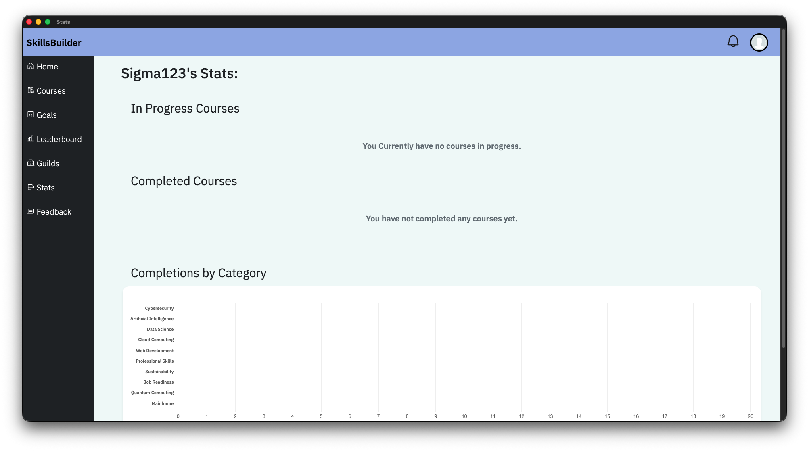
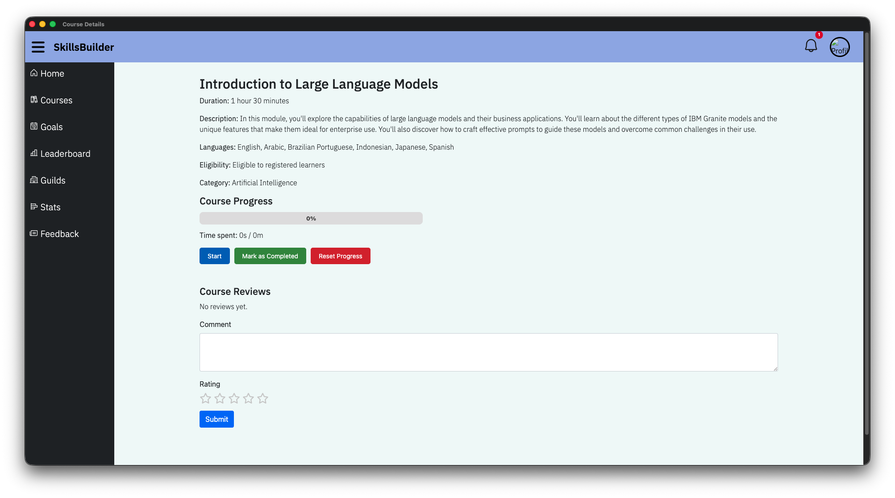
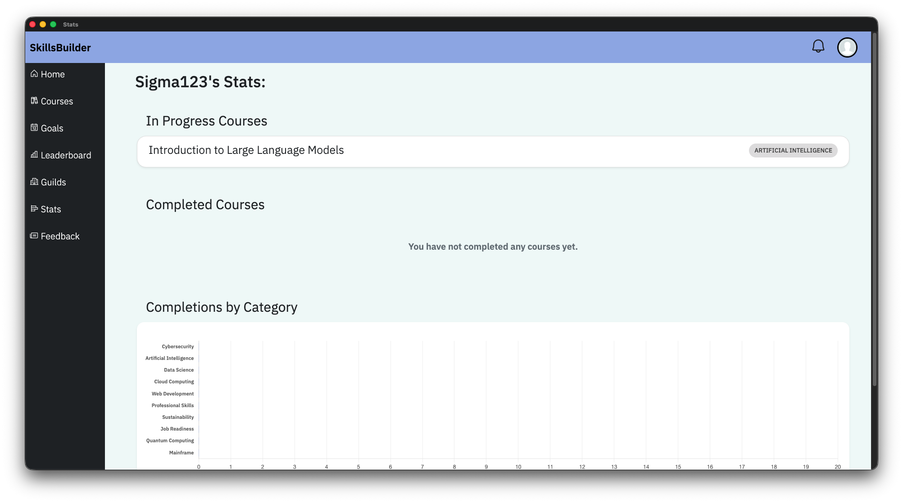
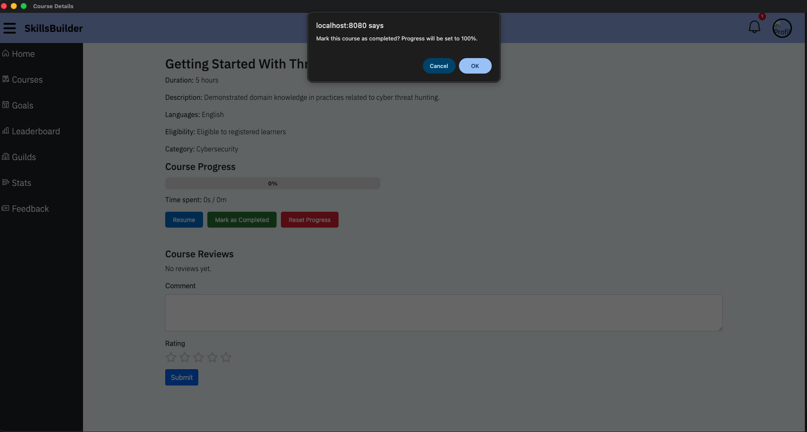
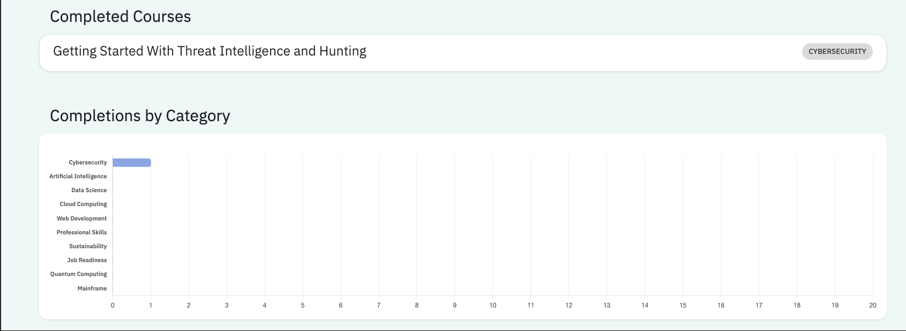
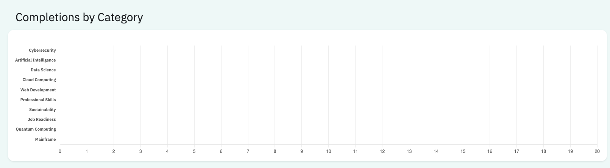
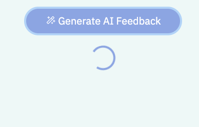
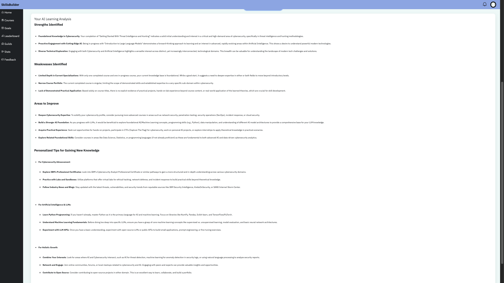

# Personalised Statsistics
The Personalised stats page allows you to see the current progress of courses, based on seeing courses in a list format, see completed courses, see the categories of courses completed and generate AI feedback from the courses in progress and those completed. The AI feedback provides an overview of the strengths, weaknesses, areas to improve and personalised study tips for the user.

## Viewing In Progress Courses
When a user starts a new course, the course the started will appear on the personalised statistics page. Courses will be displayed in a list format, with the name of the course on one side and its category on the other side.

## Viewing Completed Courses
Similar to starting new courses, completed courses will also appear on the personalised statistics page. This will showcase the name of the course and its category

## Viewing Courses completed based on categories
In order to show the user progression, the user is able to see courses they have completed based on their category as a bar chart format. This showcases every category of course available and once a user has completed a course, the chart updates with the category of course completed. The user is also able to hover on the bar chart to see the number of courses they have completed from that category.

## Generating AI feedback
The personalied stats page includes a button to generate feedback from the AI. This generates a list of strengths, weaknesses, areas to improve and personalised study tips for users based on the number of courses completed and the courses currently in progress.

## Summary:
* View the courses in progress along with their category in a list format
* View the courses completed along with their category in a list format
* View the categories of each course completed as a bar chart.
* Generate AI personalised feedback from the courses completed and in progress
* View personalised strengths, weaknesses, areas to improve and provide personalised tips from AI generated feedback.