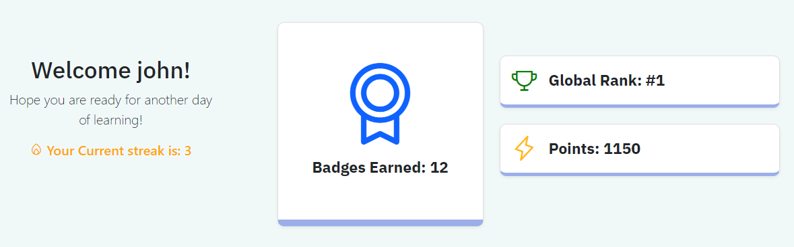
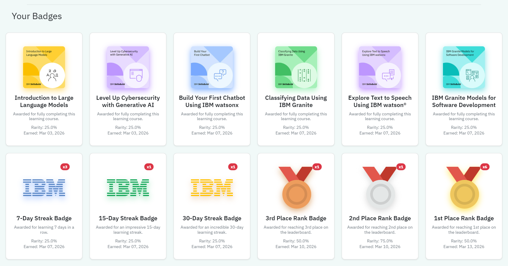
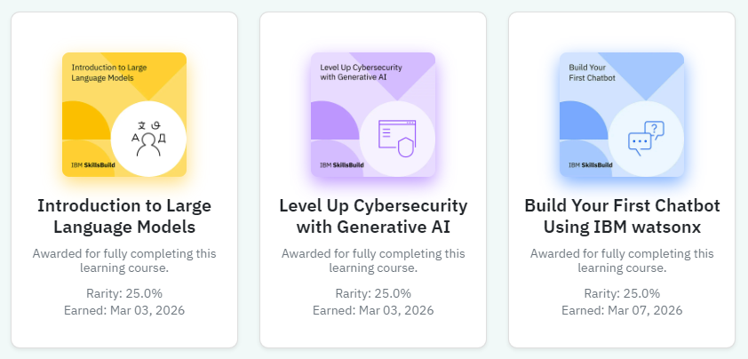
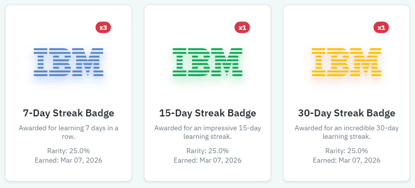
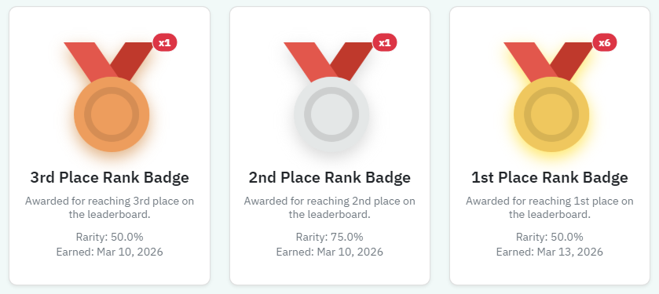

# Rewards and Incentives - User Documentation

## Table of Contents

1. [Overview](#overview)
2. [Points System](#points-system)
3. [Badges Overview](#badges-overview)
4. [Course Badges](#course-badges)
5. [Daily Streak Badges](#daily-streak-badges)
6. [Leaderboard and Rank Badges](#leaderboard-and-rank-badges)

---

## Overview

The **Rewards and Incentives** system brings gamification to the SkillsBuilder Simulator. It is designed to encourage consistent learning, promote healthy competition, and visually reward users for their achievements. The system evaluates user progress in real-time, automatically granting points and badges that dynamically appear on the user's dashboard.

Key capabilities:
- **Points Economy** - earn points automatically upon first-time course completions.
- **Milestone Badges** - collect unique badges for courses, login streaks, and competitive standings.
- **Leaderboard Rankings** - compete against other users for the top 3 spots to earn prestigious metallic rank badges.
- **Repeatable Awards** - certain badges can be earned multiple times, visibly stacking on your dashboard.

---

## Points System

Points are the primary currency of the SkillsBuilder Simulator. They represent your overall learning investment and determine your standing on the global leaderboard.

- **Earning Points:** You receive **100 Points** the *first time* you successfully complete a SkillsBuild course (when progress reaches 100%).
- **Retakes:** You can reset a course and retake it, but points are only distributed on the initial completion to prevent abuse.
- **Point Tracking:** Your total points are prominently displayed on your personal dashboard as above and dictate your placement on the competitive leaderboard.

---

## Badges Overview

Badges serve as a visual trophy case on your Dashboard. The system supports three distinct categories of badges: **Course Badges**, **Streak Badges**, and **Rank Badges**.

Depending on the badge type, you may be able to earn them multiple times. If a badge is repeatable, an indicator (e.g., `x2`, `x3`) will appear in the corner of the badge card on your dashboard, showing how many times you have achieved that specific milestone without cluttering your UI with duplicate images.

---

## Course Badges

Course Badges denote the completion of specific learning materials. 

- **How to Earn:** Reach 100% completion on any configured course.
- **Display:** The badge uses the course's thumbnail/image as the trophy.
- **Integration:** These badges serve as a historic log of the topics you've covered.

---

## Daily Streak Badges

The system automatically monitors your activity patterns and rewards consistency through "Streak Badges". Maintaining a daily login or activity streak awards progression-based badges.

| Streak Milestone | Badge Earned  |
|------------------|---------------|
| **7 Days**       | 7-Day Streak  |
| **15 Days**      | 15-Day Streak |
| **30 Days**      | 30-Day Streak |

*Note: Streak badges can stack. If you hit a 7-day streak multiple independent times, your multiplier will increase.*

---

## Leaderboard and Rank Badges

To foster friendly competition, a global leaderboard ranks all users based on their total points.

### Real-Time Rank Evaluation
You do not need to manually visit the Leaderboard page to receive your standing. The application silently evaluates the global leaderboard rankings in the background every time you load your dashboard. 

### Rank Badges
If you place in the Top 3 (and have greater than 0 points), you are automatically awarded a distinguished **Rank Badge**:

- **1st Place:** Gold Medal
- **2nd Place:** Silver Medal
- **3rd Place:** Bronze Medal

*Note: Rank badges can stack. If you hit a 7-day streak multiple independent times, your multiplier will increase.*

**Anti-Spam Metrics:** Rank badges are awarded dynamically, but are protected by a daily anti-spam limit. You can collect multiple 1st Place badges if you maintain or reclaim the top spot over several days, but the system restricts it to one award per day to prevent the multiplier from artificially inflating every time you refresh the page.

