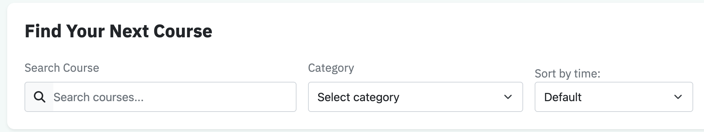
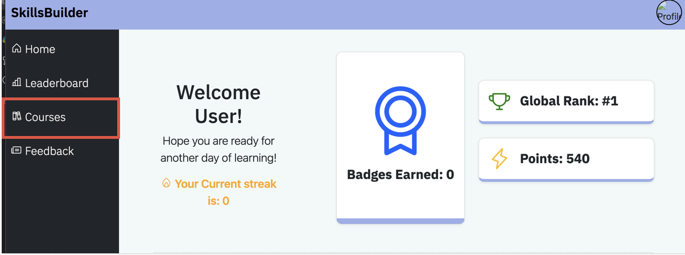
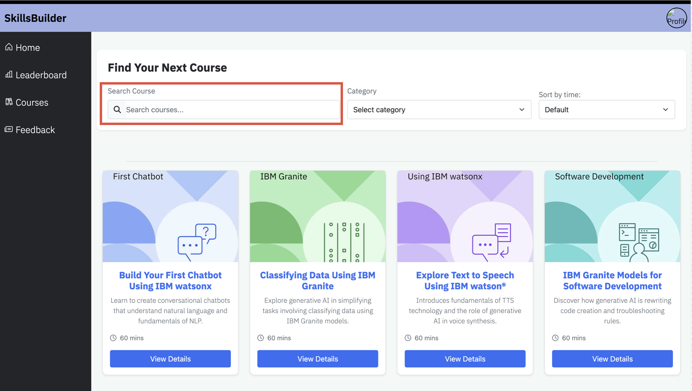
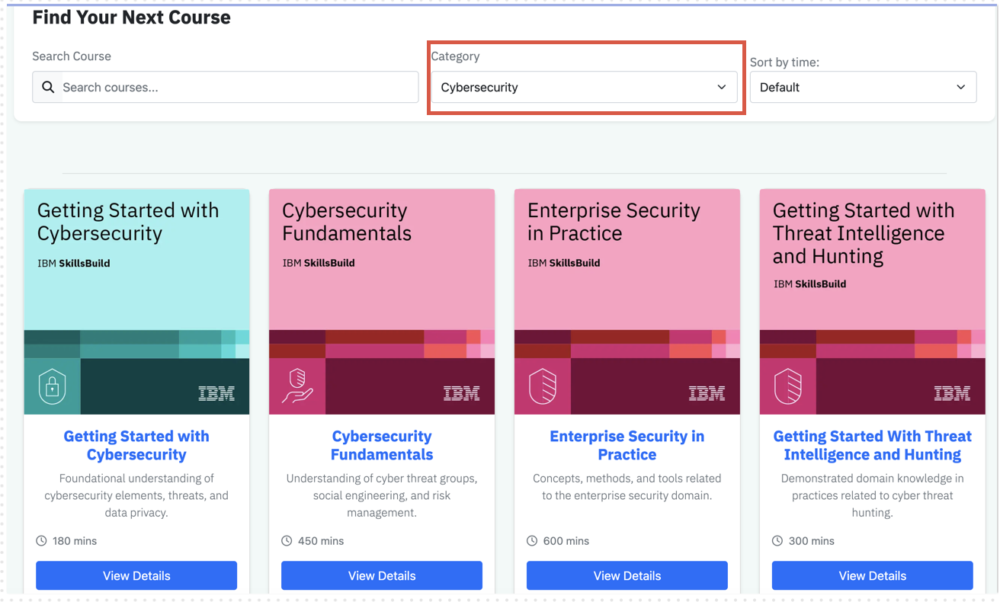
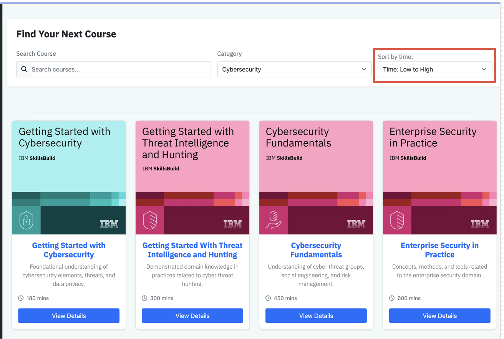

## Searching and filtering courses
The search and filter bar allows you to search courses using text, filter the search results by category and order the results based on the order of time it takes to complete, this can be in ascending and descending order.

### Accessing the list of courses
After you log onto the application, you would be directed to the user dashboard, this has many features but to access the list of courses you need to press the courses button.

### Text based search
You can filter courses by searching the name of the course you would like to search up, this can be the whole name or the partial name of the course you want.
Once you have entered what you want to search you press the enter key on your keyboard.
If it matches any of the courses, it then displays a list of courses of which you can complete.

### Categorical filtering
With the search filter, you can filter several categories if courses to help you find a course that interests you.
To do this, go onto the search section which was discussed on how to get to previously. Once you have the search section of the page, there is a dropdown menu which says category. Once you press that you can see a list of categories.

#### Removing the filter
If you do not want to filer courses anymore, you can follow the same steps of applying the filter, but you should press select categories.

### Ordering by time
With the dropdown menu to order by time you can order the courses based on the time to complete, this can be in ascending or descending order.
To do this you press the dropdown menu under the sort by time section. It will be set to default which means the courses are not ordered by time. You then have the option of selecting which order you want the courses to be in and the results would be shown in the order.

#### Removing the order
If you want the courses to no longer be ordered based on time, you can follow the same procedure as setting the order and selecting ‘default’.

### Summary of features
- Limit the search to courses of a specific category
- Search for courses by text, to find more relevant courses
- Ordering the courses based on time
- Real time updating of the courses through using one of a combination of all search and filter features