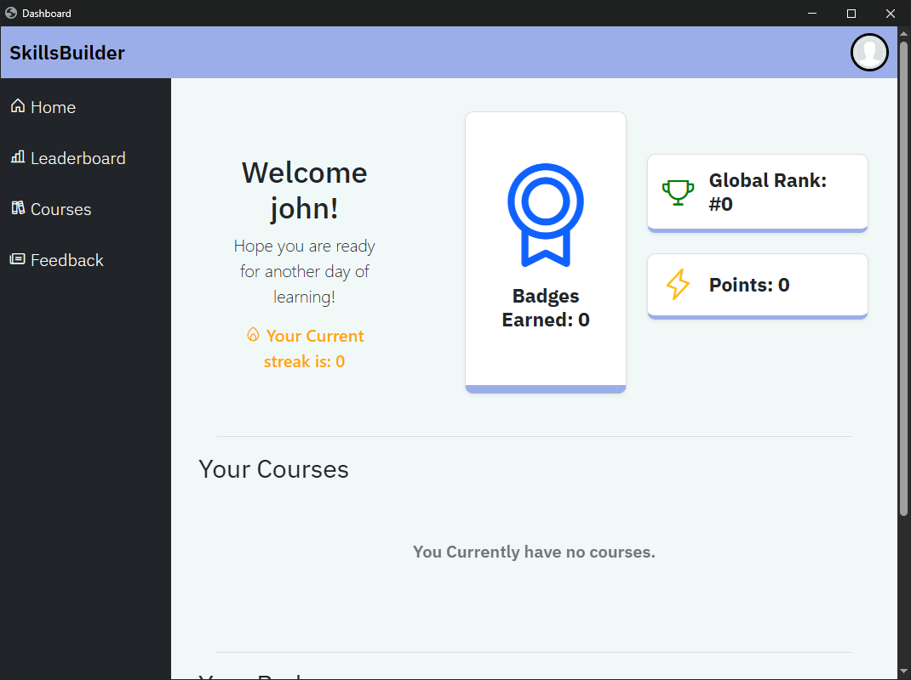
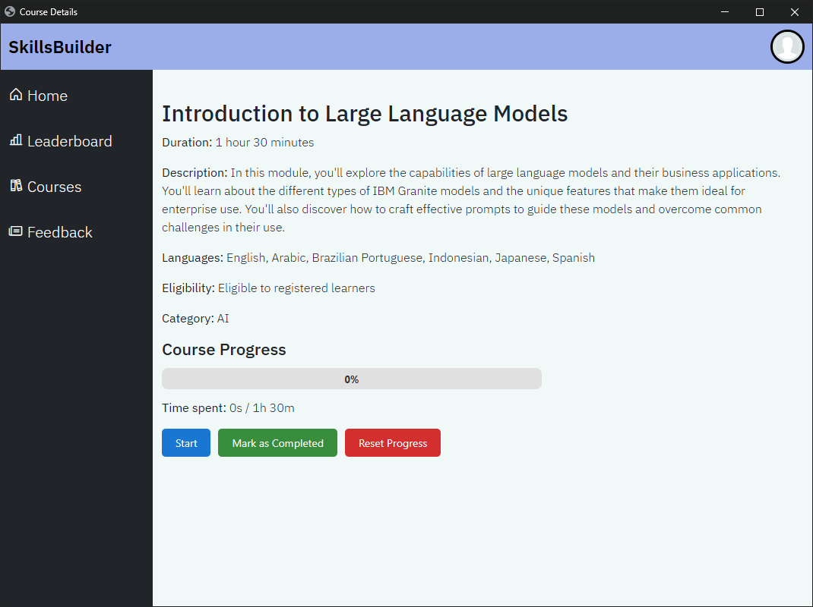
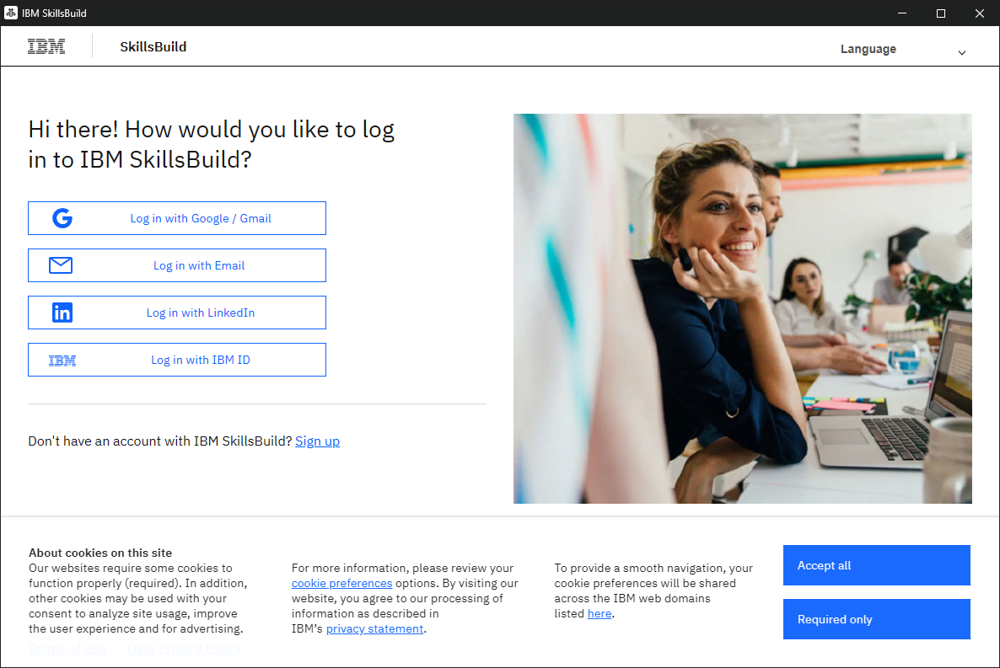
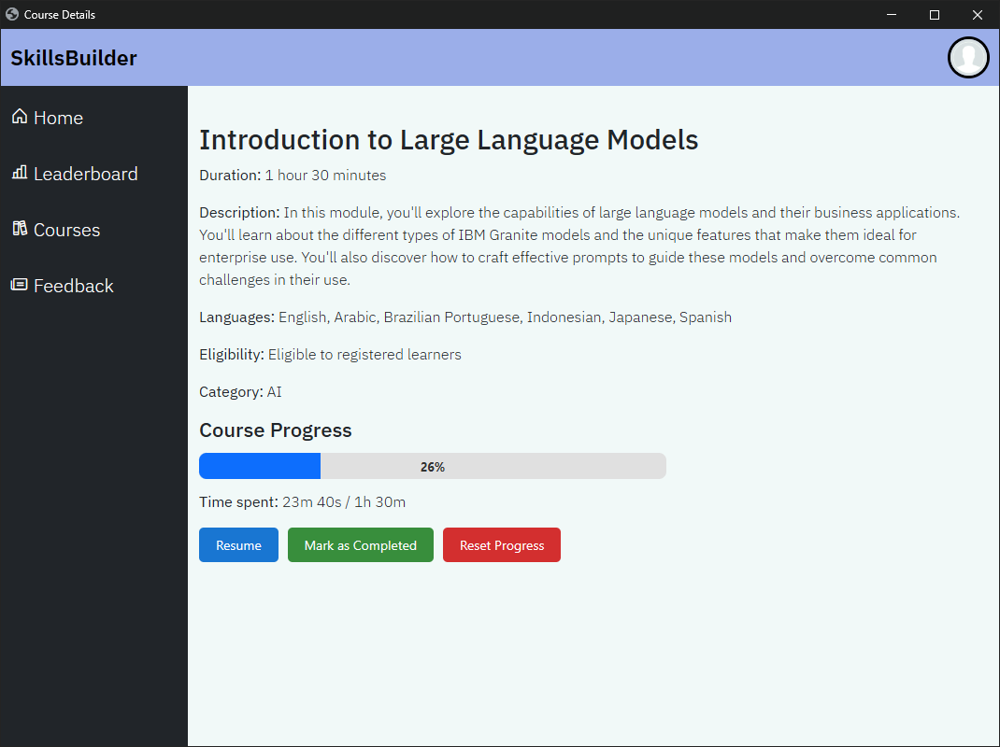
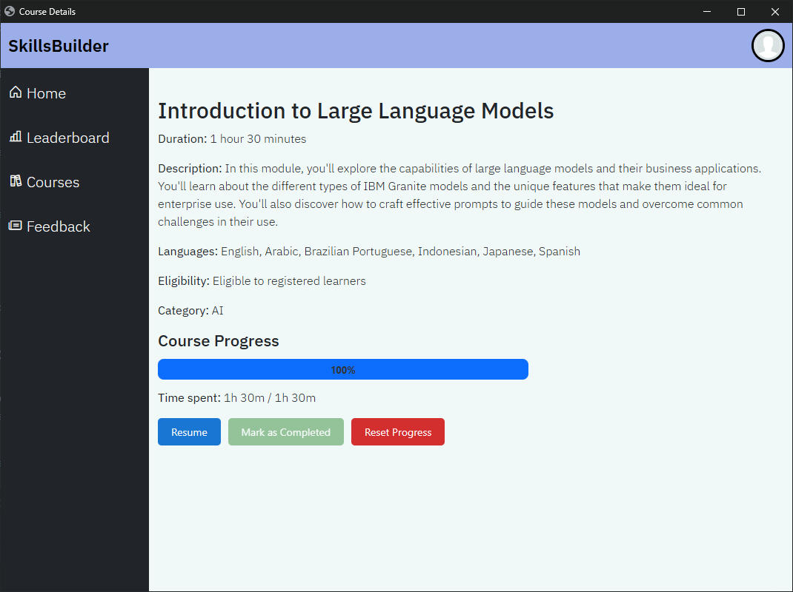
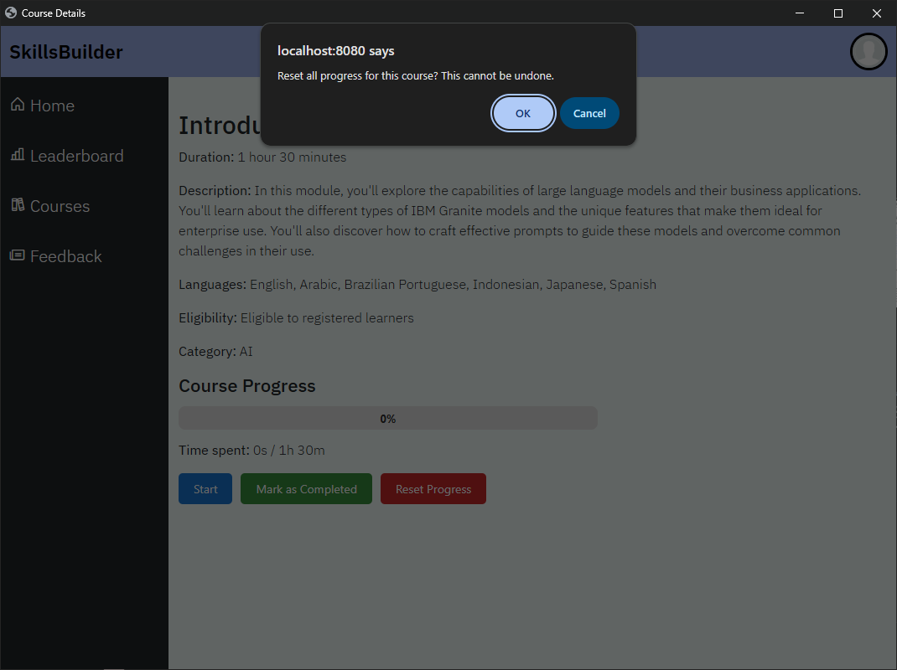

# SkillsBuilder Simulator - User Documentation

## Table of Contents

1. [Overview](#overview)
2. [Course Details Page](#course-details-page)
3. [Starting a Course](#starting-a-course)
4. [Automatic Time Tracking](#automatic-time-tracking)
5. [Pausing and Resuming](#pausing-and-resuming)
6. [Completing a Course](#completing-a-course)
7. [Resetting Progress](#resetting-progress)
8. [Configuration Options](#configuration-options)
9. [Troubleshooting](#troubleshooting)

---

## Overview

The **SkillsBuilder Simulator** is a course tracking platform that integrates with IBM SkillsBuild. It allows users to browse courses, open them in an embedded Selenium-controlled Chrome browser, and automatically track time spent studying. The system records progress, awards points on course completion, tracks daily login streaks, and provides a competitive leaderboard.

Key capabilities:

- **Automated time tracking** - time is recorded via Chrome DevTools Protocol (CDP) heartbeats sent every 5 seconds while you study.
- **Smart pause/resume** - sessions automatically pause when you switch away from the course tab and resume when you return.
- **Tab close detection** - closing the course window automatically saves your progress and completes the session.
- **Gamification** - earn 100 points each time you complete a course for the first time.

---

## Course Details Page

Clicking **View Details** on a course card opens the details page, which shows:

- **Course name** and **description**
- **Duration** (formatted in hours and minutes)
- **Languages**, **Eligibility**, and **Category**
- **Progress bar** - a visual indicator of how much of the course you have completed (0–100%)
- **Time spent** - displayed as `time spent / total duration`

### Action Buttons

| Button              | Description                                                                 |
|---------------------|-----------------------------------------------------------------------------|
| **Start / Resume**  | Opens the course in an embedded Chrome window and begins tracking time.     |
| **Mark as Completed** | Manually marks the course as 100% complete. Disabled once already complete. |
| **Reset Progress**  | Deletes all session data and resets progress to 0%. This cannot be undone.  |

---

## Starting a Course

1. On the course details page, click the **Start** button (or **Resume** if you have previously started the course).
2. The application creates a new tracking session on the server.
3. A new Chrome window or tab opens automatically via Selenium, navigating to the IBM SkillsBuild course URL.
4. Time tracking begins immediately - you will see the progress bar and time counter update as you study.

The button label changes from **Start** to **Resume** once you have at least one prior session, so you always know whether this is your first time or a continuation.

### How the Embedded Browser Works

The application uses **Selenium WebDriver** to control a Chrome instance. When a course is opened:

1. A new Chrome window (or tab) is created.
2. A **CDP (Chrome DevTools Protocol) tracking script** is injected into the page before it loads.
3. This script sends **heartbeat signals** to the server every 5 seconds, confirming you are actively studying.
4. The script also monitors **focus and blur events** to detect when you switch away from the course.

This approach works transparently - you interact with the SkillsBuild course normally while the tracking happens in the background.

---

## Automatic Time Tracking

Time tracking is fully automatic once a course is opened. The system uses multiple layers to ensure accurate tracking:

### Heartbeats

- The injected CDP script sends a **heartbeat** to the server every **5 seconds**.
- Each heartbeat updates the session's accumulated time on the server.
- The progress bar and time display on the details page refresh every **5 seconds** via polling.

### Inactivity Detection

- If no heartbeat is received for **20 seconds**, the server automatically **pauses** the session.
- This prevents time from accumulating when you step away from the computer or lose your internet connection.

### Progress Calculation

Progress is calculated as a pecentage of the accumulated total seconds value a user has spent on the external course page and the course's expected duration in seconds.

---

## Pausing and Resuming

### Automatic Pause/Resume

The system automatically manages pause and resume based on your browser focus:

| Action                              | Result                          |
|-------------------------------------|---------------------------------|
| Switch away from the course tab     | Session is **paused** automatically |
| Switch back to the course tab       | Session is **resumed** automatically |
| Minimise the course window          | Session is **paused**           |
| No activity for 20+ seconds         | Session is **paused** server-side |

A brief **5-second grace period** after the course page first loads prevents the session from immediately pausing during initial page navigation.

### Manual Pause

There is no manual pause button - the system handles pause and resume entirely through focus detection. Simply switch to a different window or tab to pause, and return to the course to resume.

---

## Completing a Course

There are two ways to complete a course:

### 1. Closing the Course Tab/Window

When you close the Chrome tab or window that contains the course:

- The system detects the closure within **2 seconds** (via a background monitoring thread).
- The session is automatically **completed** and all accumulated time is saved.
- Your progress is preserved and will be displayed on the details page.

### 2. Marking as Complete Manually

If you have finished a course but the progress bar has not reached 100%:

1. Navigate to the course details page.
2. Click **Mark as Completed**.
3. Confirm the action in the dialog that appears.
4. The system fills the remaining time to reach the full course duration and sets progress to 100%.

**Note:** The Mark as Completed button is disabled once progress has already reached 100%.

### Points Reward

The **first time** you complete a course, you are awarded **100 points**. Completing the same course again (after resetting progress) does not award additional points.

---

## Resetting Progress

If you want to start a course from scratch:

1. Navigate to the course details page.
2. Click the **Reset Progress** button (shown in red).
3. Confirm the action in the dialog.

**Warning:** This permanently deletes **all** session data for that course. Your progress will return to 0% and your time spent will reset. This action cannot be undone.

---

## Configuration Options

The application supports two configurable modes that affect how courses are opened. These are set in the application configuration and are not typically changed by end users, but are documented here for completeness.

### Course Open Mode

| Mode    | Behaviour                                                                 |
|---------|---------------------------------------------------------------------------|
| `popup` | Course opens in a **new popup window** (1200×800 pixels). This is the default. |
| `tab`   | Course opens in a **new browser tab** within the same Chrome window.       |

Both modes use identical CDP tracking - heartbeats, auto-pause/resume, and tab-close detection work the same way regardless of which mode is selected.

### Launch Mode

| Mode      | Behaviour                                                              |
|-----------|------------------------------------------------------------------------|
| `app`     | Chrome opens in **app mode** - a clean window without the address bar, tabs, or browser chrome. This is the default. |
| `browser` | Chrome opens as a **standard browser window** with the full browser UI. |

---

## Troubleshooting

### Course window does not open

- Ensure that Google Chrome is installed on your system.
- The application uses Selenium WebDriver to control Chrome. If Chrome is not found, the course cannot be opened.
- Check that no other Selenium/ChromeDriver processes are running that might conflict.

### Progress is not updating

- The progress bar refreshes every 5 seconds. Wait a moment and check again.
- If the course tab has lost focus for more than 20 seconds, the session may have been auto-paused. Click back into the course tab to resume.
- Ensure you have a stable network connection - heartbeats require the server to be reachable.

### Session shows as paused unexpectedly

- The server auto-pauses sessions after 20 seconds of inactivity (no heartbeat received).
- Switching to a different application or minimising the course window will trigger an auto-pause.
- Simply return focus to the course tab to resume the session.

### Points not awarded after completion

- Points are only awarded the **first time** a course is completed. If you have previously completed this course (even if you reset progress afterward), no additional points are given.

### Application closes when Chrome is closed

- If you close all Chrome windows (including the main application window), the Spring application shuts down gracefully. This is by design - relaunch the application to start a new session.
