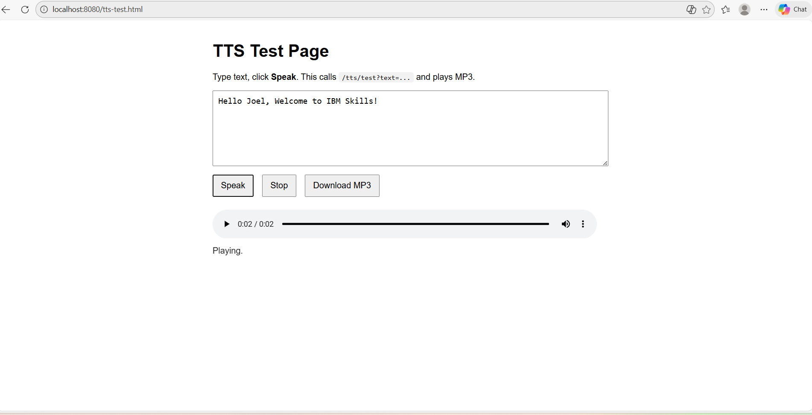

### Text Input

### Audio Playback

# Text-to-Speech User Manual

## Overview
This feature allows users to convert typed text into spoken audio using the ElevenLabs API.

## How to Use
1. Open the Text-to-Speech test page.
2. Enter the text you want to convert.
3. Click the play or generate button.
4. The audio will be generated and played automatically.

## Example
Input:
Hello world

Output:
Spoken audio played in the browser.

## Requirements
- Backend service running
- Internet connection

## Notes
- Audio generation may take a few seconds.