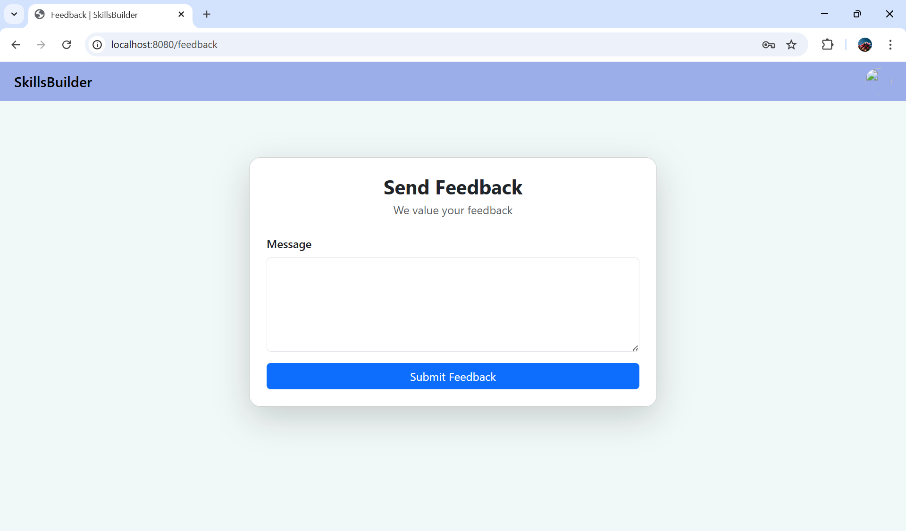
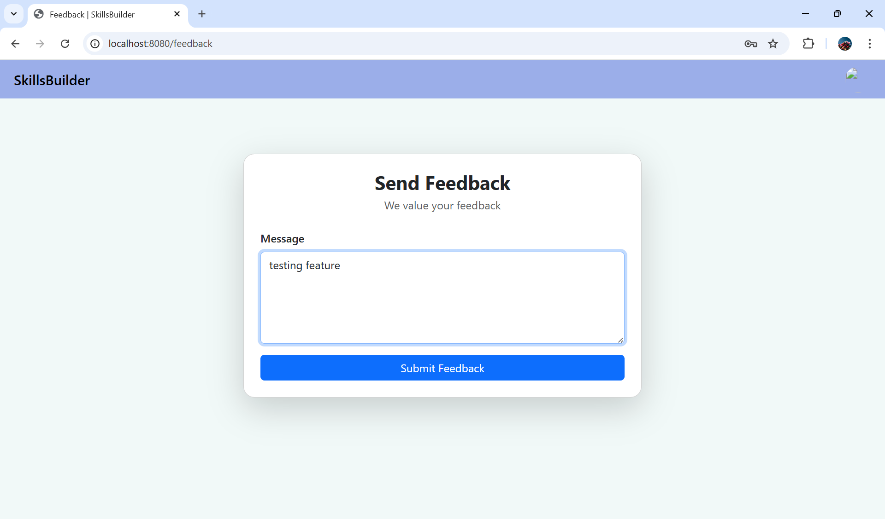
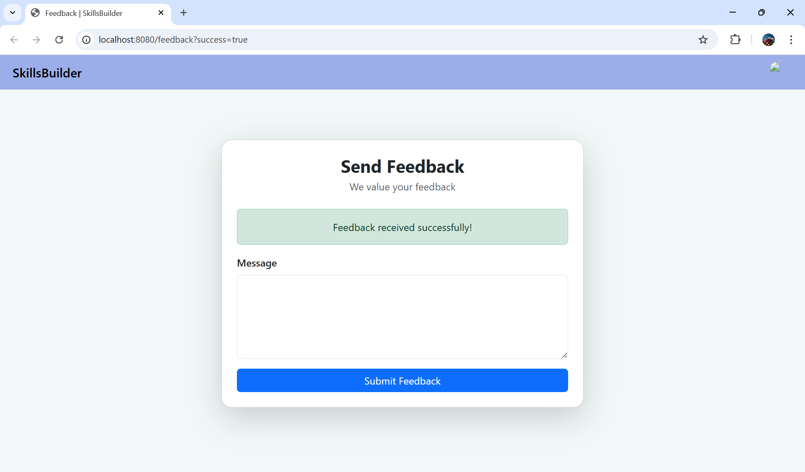

# User Feedback Feature Documentation

The User Feedback feature allows users to submit feedback, report issues, or provide suggestions through a feedback form. The feedback is stored in the system database and linked to the currently logged-in user.

This feature improves communication between users and system administrators by providing a structured way to collect feedback.

## Accessing the Feedback Form

Users can access the feedback form by navigating to:
http://localhost:8080/feedback
Users must be logged in to submit feedback.

## How to Submit Feedback

1. Navigate to the feedback page
2. Enter your feedback message in the text area
3. Click the **Submit Feedback** button
4. A success message will appear confirming the feedback was submitted

## Expected Outcome

- The feedback message is saved successfully in the database
- The feedback is associated with the currently logged-in user
- The user receives confirmation that the feedback was submitted
- The system handles errors appropriately if submission fails

## User Interface

The feedback page contains:

- Message input text area
- Submit Feedback button
- Success or error message display

## Technical Components

### Controller

- FeedbackPageController  
  Handles displaying the feedback form and processing feedback submissions.

### Service

- UserFeedbackService  
  Handles business logic for saving feedback.

### Repository

- UserFeedbackRepository  
  Handles database operations for feedback storage.

### View

- feedback.jsp  
  Provides the user interface for submitting feedback.

## Database Storage

Feedback is stored in the database using the UserFeedback entity. Each feedback record includes:

- Feedback ID
- Message content
- Associated user
- Timestamp 

## Feature Status

- Feedback form implemented
- Feedback submission working
- Database storage working
- User association working
