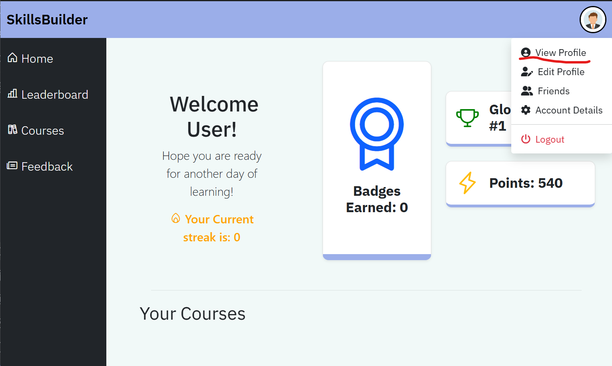
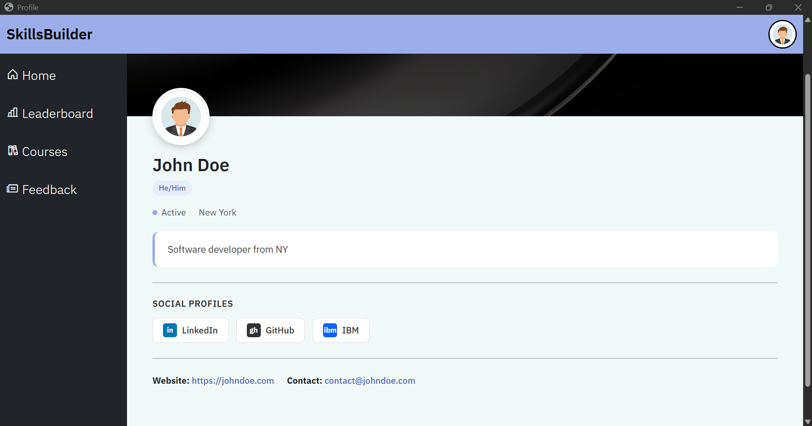
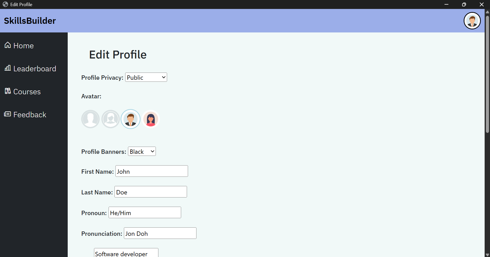
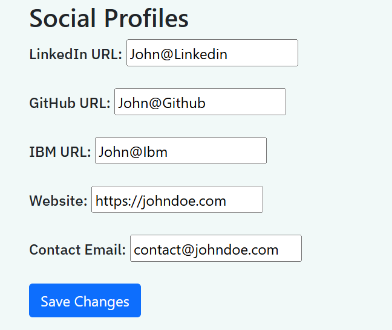
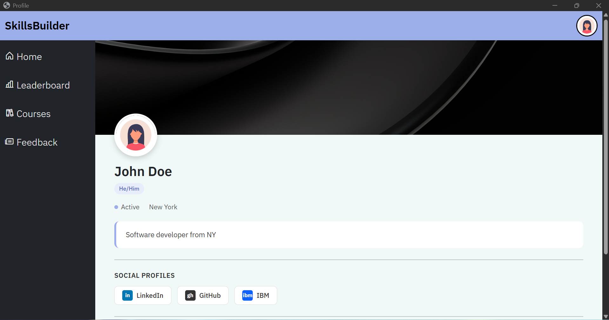
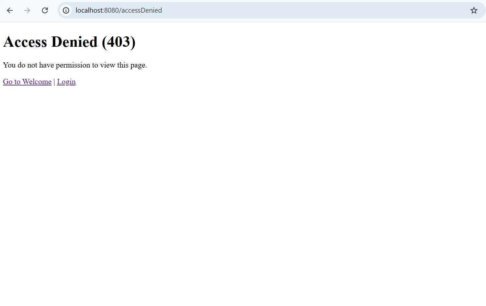

# User Profile

The user profile page displays a user's personal information, including their name, bio, and social media links. It also provides full customization options, allowing users to tailor their profile to reflect their personality and preferences. This customization enhances user satisfaction and engagement with the Skills-Build platform.

---

## Accessing the Profile

After registering or logging into the application, users are redirected to their personalized dashboard.

To access the profile:
1. Click the avatar located at the top-right corner of the site.
2. A drop-down menu will appear.
3. Select **View Profile**.

This will redirect you to your personal profile page, displaying your stored user information.

---

## Profile Showcase

The profile page displays the following details:

- First name and last name
- Status and location
- Personal bio
- Social media links:
    - GitHub
    - LinkedIn
    - IBM Academic
- Contact email address

---

## Editing the Profile

To create or edit your profile:

1. Click the avatar at the top-right corner of the page.
2. Select **Edit Profile** from the drop-down menu.
3. You will be redirected to the **Edit Profile** page.

On this page, you can modify all aspects of your profile, including:
- Personal details
- Bio and social media links
- Profile avatar
- Background image

These customization options allow users to personalize their profile visually and functionally.

---

## Saving Changes

Once all desired changes have been made:

1. Scroll to the bottom of the page.
2. Click the **Save Changes** button.

The updated profile is saved to the database, and you will be redirected back to your profile page where the changes will be visible immediately.

---

## Visual change example

This shows a change of avatar as an example.

---

## User input and valid / invalid results,

Current User logged in CANNOT access another users editProfile/{otheruser_id} to ensure that their profile is restrictive to themselves.

Example: Logged in as john, I have the user id of 2, going to /editProfile/3
This in turn results into the access denied URL

